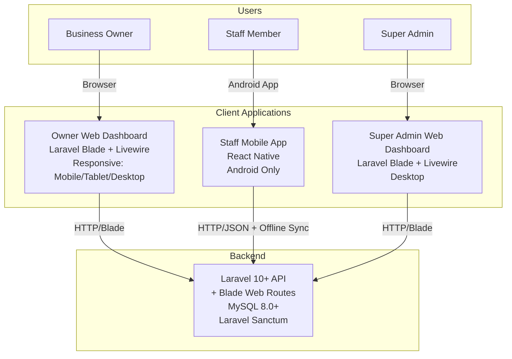
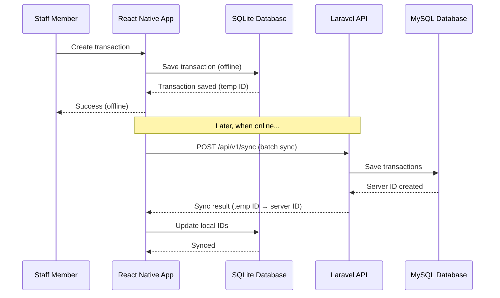
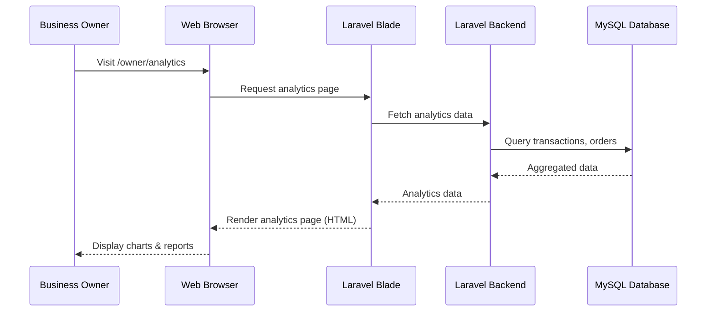
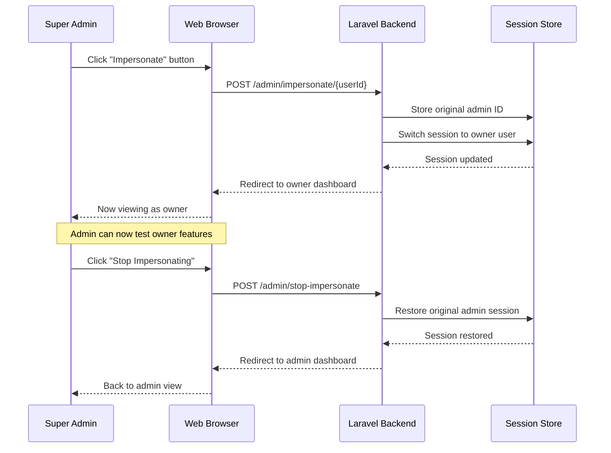

# GastoTrack - Final Architecture Summary

**Date:** January 2025  
**Status:** Specs Complete, Ready for Implementation  

---

## Overview

GastoTrack is a Filipino business expense tracking system with a clear separation of client types:

- **Business Owners** → Responsive Web Dashboard (access via mobile/tablet/desktop browsers)
- **Staff Members** → React Native Mobile App (Android)
- **Super Admins** → Web Dashboard (platform management)

---

## Architecture Diagram



---

## Technology Stack

### Backend API
- **Framework:** Laravel 10+ with PHP 8.1+
- **Database:** MySQL 8.0+
- **Authentication:** Laravel Sanctum (tokens for mobile, session for web)
- **Architecture:** RESTful API + Server-Side Rendered Blade views

### Owner Web Dashboard
- **Framework:** Laravel Blade + Livewire 3.x
- **Styling:** Tailwind CSS
- **Theme:** Green (#00C897)
- **Responsive:** Yes (mobile, tablet, desktop browsers)
- **Features:** Full business management, analytics, goals, staff management

### Staff Mobile App
- **Framework:** React Native
- **Platform:** Android
- **Architecture:** Offline-first with SQLite local storage
- **Sync:** Background sync with Laravel API
- **Features:** Transactions, stock, orders, e-wallet integration

### Super Admin Web Dashboard
- **Framework:** Laravel Blade + Livewire 3.x
- **Styling:** Tailwind CSS
- **Theme:** Purple (#6366F1)
- **Features:** Platform management, business oversight, impersonation, audit logs

---

## User Roles & Access

| Role | Access Method | Features |
|------|---------------|----------|
| **Business Owner** | Web Dashboard Only<br/>(Browser on any device) | Full business management<br/>Analytics & reports<br/>Goals tracking<br/>Staff management<br/>Product & stock management<br/>Transaction oversight |
| **Staff Member** | Mobile App Only<br/>(React Native Android) | Daily transactions<br/>E-wallet capture<br/>Orders/POS<br/>Basic stock management<br/>Product viewing |
| **Super Admin** | Web Dashboard Only<br/>(Desktop browser) | Platform management<br/>All businesses overview<br/>User impersonation<br/>System settings<br/>Audit logs |

---

## Key Architectural Decisions

### ✅ Decision 1: Owners Use Web Only
**Rationale:**
- Better analytics and reporting experience on larger screens
- No need for offline capability (owners primarily work in office)
- Easier to maintain one web codebase vs dual mobile/web
- Web dashboard is responsive, works on mobile browsers

**Impact:**
- Need to remove Owner screens from React Native app
- Owner login attempts in mobile app should redirect to web

### ✅ Decision 2: Staff Use Mobile Only
**Rationale:**
- Staff are mobile by nature (field work, store floor)
- Need offline capability for areas with poor connectivity
- E-wallet notification capture requires mobile OS integration
- Faster data entry on mobile for daily transactions

**Impact:**
- Mobile app focuses solely on staff features
- Simpler navigation and smaller APK size

### ✅ Decision 3: Laravel Blade for Web Dashboards
**Rationale:**
- API already built in Laravel
- Faster development than separate React SPA
- SEO-friendly (if needed for marketing pages)
- Livewire provides reactive components without complex JS build

**Alternative Rejected:** React + TypeScript + Vite (would require separate frontend build, more complexity)

### ✅ Decision 4: Single Laravel Codebase
**Rationale:**
- API + Owner Web + Admin Web share same codebase
- Reduces deployment complexity
- Shared authentication and authorization logic
- Easier to maintain consistency

**Structure:**
```
laravel-app/
├── app/Http/Controllers/
│   ├── Api/              # JSON API for mobile app
│   └── Web/              # Blade controllers for web
├── resources/views/
│   ├── owner/            # Owner dashboard Blade views
│   └── admin/            # Super Admin dashboard Blade views
├── routes/
│   ├── api.php           # API routes for mobile
│   └── web.php           # Web routes for dashboards
```

---

## Specs Created

All specs are located in `.kiro/specs/` directory:

### 1. Backend API Integration
**Location:** `.kiro/specs/backend-api-integration/`

**Files:**
- `requirements.md` - 20 requirements, 141 acceptance criteria
- `design.md` - Complete architecture, 60+ API endpoints
- `tasks.md` - 36 tasks, 8-week timeline

**Purpose:** RESTful API serving Staff mobile app + both web dashboards

**Key Features:**
- Laravel Sanctum authentication
- Role-based authorization (Owner, Staff, Super Admin)
- Offline sync for mobile app
- Comprehensive business data management
- Analytics and reporting endpoints

### 2. Owner Web Dashboard (Blade + Livewire)
**Location:** `.kiro/specs/owner-web-dashboard-blade/`

**Files:**
- `requirements.md` - 20 requirements
- `design.md` - Complete component architecture
- `tasks.md` - 34 tasks, 6-7 week timeline

**Purpose:** Responsive web interface for Business Owners

**Key Features:**
- Dashboard with analytics widgets
- Transaction management (CRUD with filters)
- Product and stock management
- Orders and POS
- Financial goals tracking
- Staff management
- Analytics and reports
- Profile and business settings

**Design:**
- Green theme (#00C897)
- Tailwind CSS styling
- Livewire 3.x reactive components
- Responsive: mobile, tablet, desktop

### 3. Super Admin Web Dashboard
**Location:** `.kiro/specs/superadmin-web-dashboard/`

**Files:**
- `requirements.md` - 20 requirements
- `design.md` - Complete component architecture
- `tasks.md` - 29 tasks, 4-5 week timeline

**Purpose:** Platform management interface for Super Admins

**Key Features:**
- Business management (view all businesses)
- User management (owners and staff)
- User impersonation
- System settings and configuration
- Audit logs and activity tracking
- Platform analytics
- Security and access control

**Design:**
- Purple theme (#6366F1)
- Tailwind CSS styling
- Livewire 3.x reactive components
- Desktop-focused (responsive for tablets)

### 4. Mobile App Owner Cleanup
**Location:** `.kiro/specs/mobile-app-owner-cleanup/`

**Files:**
- `requirements.md` - 7 requirement groups, 35+ acceptance criteria
- `design.md` - Complete cleanup architecture
- `tasks.md` - 50 tasks, 1-week timeline

**Purpose:** Remove Owner screens from React Native app (make it Staff-only)

**Actions:**
- Delete 12 owner screen files
- Delete OwnerNavigator
- Block owner login with redirect message
- Clean up Redux slices, API calls, utilities
- Remove unused dependencies (charts, AI, calendar)
- Update documentation

**Result:** Smaller APK, clearer UX, simplified codebase

---

## Implementation Timeline

### Phase 1: Backend API (8 weeks)
**Status:** ✅ Spec Complete, Ready to Implement

**Tasks:**
1. Database schema and migrations (Week 1)
2. Authentication system (Week 1-2)
3. Core CRUD endpoints (Week 2-4)
4. Advanced features (sync, analytics) (Week 5-6)
5. Testing and optimization (Week 7)
6. Deployment (Week 8)

### Phase 2: Owner Web Dashboard (6-7 weeks)
**Status:** ✅ Spec Complete, Ready to Implement

**Tasks:**
1. Project setup and auth integration (Week 1)
2. Dashboard and analytics (Week 2)
3. Transaction management (Week 2-3)
4. Product and stock management (Week 3-4)
5. Orders and goals (Week 4-5)
6. Staff management and settings (Week 5-6)
7. Testing and deployment (Week 6-7)

### Phase 3: Super Admin Dashboard (4-5 weeks)
**Status:** ✅ Spec Complete, Ready to Implement

**Tasks:**
1. Project setup and auth integration (Week 1)
2. Business and user management (Week 2)
3. Impersonation and audit logs (Week 3)
4. System settings and analytics (Week 4)
5. Testing and deployment (Week 5)

### Phase 4: Mobile App Cleanup (1 week)
**Status:** ✅ Spec Complete, Ready to Implement

**Tasks:**
1. Audit and preparation (Day 1)
2. Create owner blocked screen (Day 1-2)
3. Update navigation and auth (Day 2)
4. Delete owner screens and clean up code (Day 3)
5. Testing (Day 4)
6. Documentation and deployment (Day 5)

**Total Timeline:** ~19-21 weeks (4.5-5 months)

**Parallel Opportunities:**
- Backend API can be developed while specs for web dashboards are being created
- Owner Web and Super Admin Web can be developed in parallel after API is ready
- Mobile cleanup can be done anytime independently

---

## Data Flow Examples

### Example 1: Staff Creates Transaction (Mobile App)



### Example 2: Owner Views Analytics (Web Dashboard)



### Example 3: Super Admin Impersonates Owner



---

## Security Considerations

### Authentication
- **Mobile App (Staff):** Laravel Sanctum tokens, 30-day expiry
- **Web Dashboards (Owner/Admin):** Laravel session-based auth
- **Password Requirements:** Min 8 characters, mix of letters/numbers

### Authorization
- **Role-Based Access Control (RBAC):** Owner, Staff, Super Admin roles
- **Business Scoping:** Users can only access their own business data
- **Policies:** Laravel policies enforce permissions on all resources

### Data Protection
- **HTTPS Only:** All communication encrypted
- **SQL Injection Prevention:** Eloquent ORM parameterized queries
- **XSS Prevention:** Blade template escaping by default
- **CSRF Protection:** Laravel CSRF tokens on all forms

### Audit Trail
- **Activity Logs:** All data modifications logged (user, action, old/new values)
- **Impersonation Logs:** All impersonation sessions logged
- **API Logs:** All API requests logged with authentication info

---

## Offline-First Strategy (Mobile App)

### How It Works

1. **Local SQLite Database:** Staff mobile app maintains full local copy of business data
2. **Immediate Writes:** All CRUD operations write to local DB first
3. **Background Sync:** Periodic sync sends local changes to server
4. **Conflict Resolution:** Last-write-wins strategy (server timestamp comparison)

### Sync Process

```
1. Mobile detects connectivity
2. Gather local changes since last sync
3. POST /api/v1/sync with batch of changes
4. Server processes changes, detects conflicts
5. Server returns:
   - Success confirmations (temp ID → server ID mappings)
   - Conflicts (both versions returned)
   - Server changes since last sync
6. Mobile updates local DB with server data
7. Mobile notifies user of any conflicts
```

### Conflict Handling

**Example:** Staff edits transaction offline, Owner deletes it online

```
Mobile: {"id": "temp-123", "amount": 150, "updated_at": "2025-01-20T10:00:00Z"}
Server: {"id": 456, "deleted_at": "2025-01-20T09:00:00Z"}

Resolution: Server wins (deleted), mobile removes local copy
```

---

## Deployment Architecture

### Production Environment

```
┌─────────────────────────────────────────────┐
│           Load Balancer / Nginx             │
│         SSL Termination (Let's Encrypt)     │
└─────────────────────────────────────────────┘
                      │
          ┌───────────┴───────────┐
          │                       │
┌─────────▼─────────┐   ┌────────▼──────────┐
│  Laravel Instance │   │  Laravel Instance │
│  (Web + API)      │   │  (Web + API)      │
│  PHP 8.1 + FPM    │   │  PHP 8.1 + FPM    │
└───────────────────┘   └───────────────────┘
          │                       │
          └───────────┬───────────┘
                      │
          ┌───────────▼───────────┐
          │   MySQL 8.0+ Database │
          │   (Master-Slave)      │
          └───────────────────────┘
                      │
          ┌───────────▼───────────┐
          │   Redis (Cache/Queue) │
          └───────────────────────┘
```

### Mobile App Distribution

- **Android:** Google Play Store (Staff Edition)
- **Update Strategy:** Rolling updates, feature flags
- **Minimum Android Version:** Android 8.0+ (API 26)

### Web Dashboard Hosting

- **Recommended:** DigitalOcean, AWS, or Laravel Forge
- **Requirements:** PHP 8.1+, MySQL 8.0+, Redis (optional)
- **Backups:** Daily automated database backups (30-day retention)

---

## Future Enhancements

### Phase 5: Advanced Features (Future)
- **Multi-Language Support:** Filipino (Tagalog), Cebuano, Ilocano
- **Export to PDF:** Financial reports, invoices
- **Email Notifications:** Goal reminders, low stock alerts
- **SMS Integration:** Transaction confirmations via SMS
- **WhatsApp Integration:** Business communication

### Phase 6: Platform Expansion (Future)
- **iOS App:** Expand mobile app to iOS platform
- **Progressive Web App (PWA):** Web version of staff screens for tablets
- **Desktop App:** Electron-based desktop app for offline POS
- **Multi-Business Support:** Single user managing multiple businesses
- **Franchise/Branch Management:** Chain businesses with multiple locations

### Phase 7: Advanced Analytics (Future)
- **Predictive Analytics:** Sales forecasting, demand prediction
- **Inventory Optimization:** AI-powered reorder suggestions
- **Profitability Analysis:** Product-level profit margins
- **Competitor Benchmarking:** Industry comparisons

---

## Success Metrics

### Development Metrics
- **API Endpoints:** 60+ RESTful endpoints
- **Code Coverage:** 80%+ test coverage
- **API Response Time:** <200ms for 95% of requests
- **Database Queries:** N+1 query prevention

### User Experience Metrics
- **Mobile App Size:** <30MB APK
- **Mobile App Launch:** <3 seconds
- **Web Dashboard Load:** <2 seconds
- **Offline Sync:** <5 seconds for 100 transactions

### Business Metrics
- **User Retention:** 80%+ monthly active users
- **Owner Satisfaction:** 4.5+ star rating
- **Staff Adoption:** 90%+ of staff use mobile app daily
- **Sync Success Rate:** 99%+ sync operations succeed

---

## Risks & Mitigation

| Risk | Impact | Mitigation |
|------|--------|------------|
| **Mobile offline sync conflicts** | Data loss | Last-write-wins + conflict UI for manual resolution |
| **Laravel learning curve** | Slower development | Use Laravel Forge for deployment, follow Laravel docs |
| **Staff resistance to mobile app** | Low adoption | Comprehensive training, clear onboarding |
| **Owner confusion about web-only** | Support tickets | Clear messaging in mobile app, smooth redirect |
| **Database performance** | Slow queries | Proper indexing, query optimization, Redis cache |
| **Third-party API failures** | Broken features | Graceful degradation, fallback mechanisms |

---

## Conclusion

GastoTrack's architecture provides a clear separation of concerns:

- **Business Owners** get a powerful, responsive web dashboard with full analytics and management tools
- **Staff Members** get a focused, offline-capable mobile app for daily operations
- **Super Admins** get platform-level oversight and management tools

This architecture balances:
- ✅ User experience (right tool for each role)
- ✅ Development efficiency (single Laravel codebase for API + web)
- ✅ Performance (offline-first mobile, server-rendered web)
- ✅ Maintainability (clear boundaries, modern tech stack)

All specs are complete and ready for implementation. Total development time: **19-21 weeks (4.5-5 months)**.

---

**Next Steps:**
1. Review and approve this architecture summary
2. Prioritize implementation phases
3. Assemble development team
4. Begin Phase 1: Backend API development
5. Set up development, staging, and production environments

**Questions or Changes?** Contact the project lead for architectural decisions or spec modifications.
