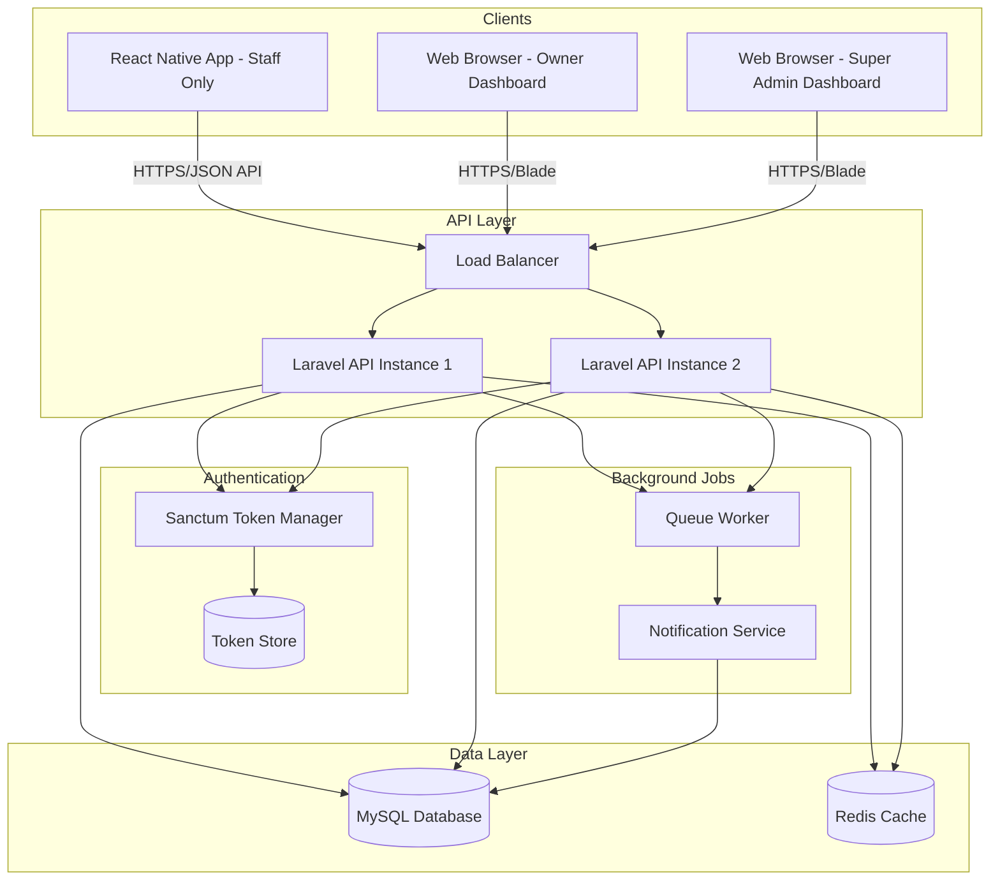
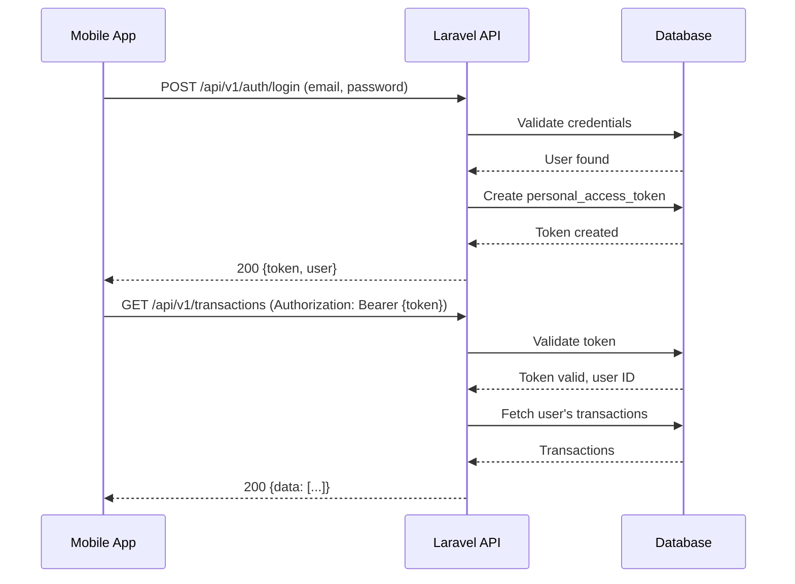
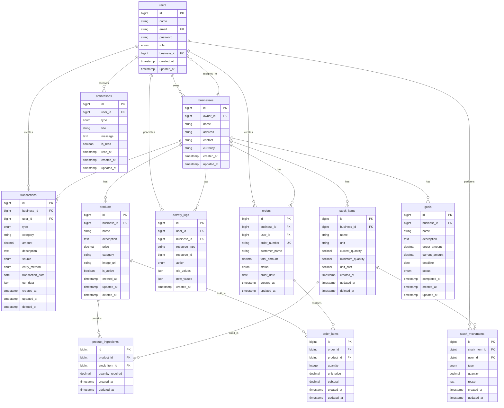
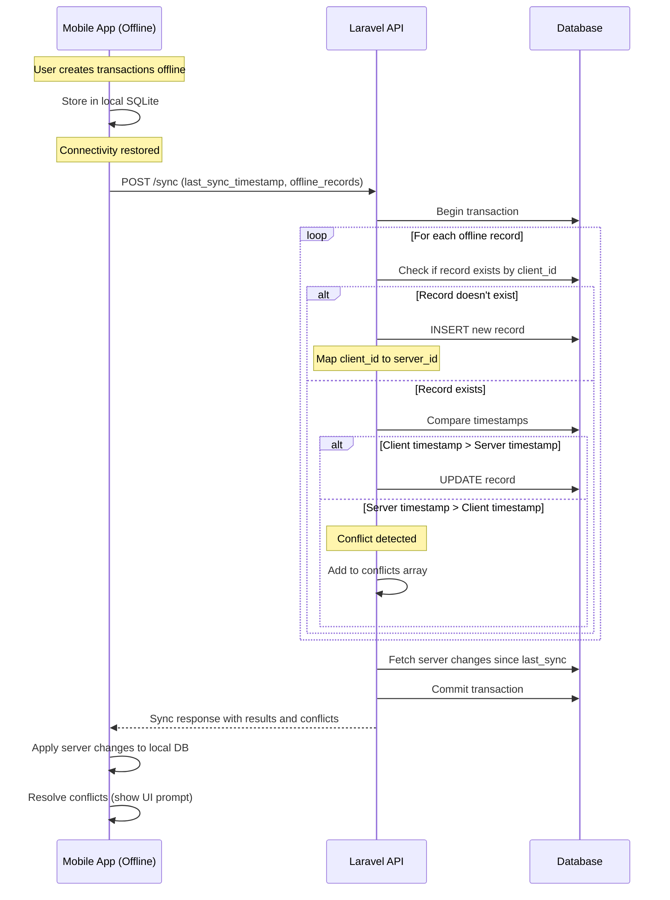

# Design Document

**Feature:** Design Backend API Integration

## Overview

The GastoTrack Backend API is a Laravel 10+ RESTful API that serves as the central data persistence layer for the GastoTrack ecosystem. The system provides secure authentication, role-based authorization, comprehensive business data management, and offline-first synchronization capabilities for Filipino small businesses.

**Client Architecture:**
- **Staff Mobile App (React Native)**: Android app using the API with offline-first sync for daily operations
- **Owner Web Dashboard (Laravel Blade)**: Responsive web interface (same Laravel app) for business owners
- **Super Admin Web Dashboard (Laravel Blade)**: Platform management interface (same Laravel app)

### Key Design Goals

1. **Offline-First Architecture**: Support mobile clients that operate independently and sync when connectivity is available
2. **Role-Based Access Control**: Distinguish between Business Owners (full permissions) and Staff Members (limited permissions)
3. **Data Integrity**: Maintain audit trails, soft deletes, and conflict resolution for all business-critical data
4. **Performance**: Optimize for mobile clients with pagination, indexing, and efficient query patterns
5. **Security**: Implement token-based authentication, input validation, and protection against common vulnerabilities
6. **Scalability**: Design for growth with connection pooling, caching, and efficient database schema

### Technology Stack

- **Framework**: Laravel 10+ with PHP 8.1+
- **Database**: MySQL 8.0+ with InnoDB engine
- **Authentication**: Laravel Sanctum for token-based API authentication
- **API Style**: RESTful with JSON responses
- **Caching**: Redis (optional, for session and query caching)
- **Queue System**: Laravel Queue for background jobs (notifications, reports)

---

## Architecture

### High-Level System Architecture



### Laravel Project Structure

```
gastotrack-api/
├── app/
│   ├── Console/
│   │   └── Commands/
│   │       ├── GenerateAnalyticsCommand.php
│   │       └── CheckLowStockCommand.php
│   ├── Exceptions/
│   │   ├── Handler.php
│   │   └── ConflictException.php
│   ├── Http/
│   │   ├── Controllers/
│   │   │   ├── Api/
│   │   │   │   ├── AuthController.php
│   │   │   │   ├── BusinessController.php
│   │   │   │   ├── TransactionController.php
│   │   │   │   ├── ProductController.php
│   │   │   │   ├── StockController.php
│   │   │   │   ├── OrderController.php
│   │   │   │   ├── GoalController.php
│   │   │   │   ├── StaffController.php
│   │   │   │   ├── NotificationController.php
│   │   │   │   ├── AnalyticsController.php
│   │   │   │   └── SyncController.php
│   │   ├── Middleware/
│   │   │   ├── CheckBusinessOwner.php
│   │   │   ├── CheckBusinessAccess.php
│   │   │   └── ValidateJsonRequest.php
│   │   ├── Requests/
│   │   │   ├── Auth/
│   │   │   ├── Business/
│   │   │   ├── Transaction/
│   │   │   ├── Product/
│   │   │   ├── Stock/
│   │   │   ├── Order/
│   │   │   └── Goal/
│   │   └── Resources/
│   │       ├── UserResource.php
│   │       ├── BusinessResource.php
│   │       ├── TransactionResource.php
│   │       ├── ProductResource.php
│   │       ├── StockItemResource.php
│   │       ├── OrderResource.php
│   │       ├── GoalResource.php
│   │       └── NotificationResource.php
│   ├── Models/
│   │   ├── User.php
│   │   ├── Business.php
│   │   ├── Transaction.php
│   │   ├── Product.php
│   │   ├── ProductIngredient.php
│   │   ├── StockItem.php
│   │   ├── StockMovement.php
│   │   ├── Order.php
│   │   ├── OrderItem.php
│   │   ├── Goal.php
│   │   ├── Notification.php
│   │   └── ActivityLog.php
│   ├── Observers/
│   │   ├── TransactionObserver.php
│   │   ├── ProductObserver.php
│   │   └── OrderObserver.php
│   ├── Policies/
│   │   ├── BusinessPolicy.php
│   │   ├── TransactionPolicy.php
│   │   ├── ProductPolicy.php
│   │   └── StaffPolicy.php
│   └── Services/
│       ├── SyncService.php
│       ├── AnalyticsService.php
│       ├── StockService.php
│       └── NotificationService.php
├── bootstrap/
├── config/
│   ├── auth.php
│   ├── sanctum.php
│   ├── cors.php
│   └── database.php
├── database/
│   ├── migrations/
│   │   ├── 2024_01_01_000001_create_users_table.php
│   │   ├── 2024_01_01_000002_create_businesses_table.php
│   │   ├── 2024_01_01_000003_create_transactions_table.php
│   │   ├── 2024_01_01_000004_create_products_table.php
│   │   ├── 2024_01_01_000005_create_product_ingredients_table.php
│   │   ├── 2024_01_01_000006_create_stock_items_table.php
│   │   ├── 2024_01_01_000007_create_stock_movements_table.php
│   │   ├── 2024_01_01_000008_create_orders_table.php
│   │   ├── 2024_01_01_000009_create_order_items_table.php
│   │   ├── 2024_01_01_000010_create_goals_table.php
│   │   ├── 2024_01_01_000011_create_notifications_table.php
│   │   └── 2024_01_01_000012_create_activity_logs_table.php
│   ├── seeders/
│   └── factories/
├── routes/
│   ├── api.php
│   └── web.php
├── storage/
├── tests/
│   ├── Feature/
│   │   ├── AuthTest.php
│   │   ├── TransactionTest.php
│   │   ├── ProductTest.php
│   │   ├── StockTest.php
│   │   ├── OrderTest.php
│   │   └── SyncTest.php
│   └── Unit/
│       ├── Services/
│       └── Models/
└── composer.json
```

---

## Components and Interfaces

### 1. Authentication System (Laravel Sanctum)

**Purpose**: Secure token-based authentication for mobile clients

**Components**:
- `AuthController`: Handles login, registration, logout, token management
- `Sanctum Middleware`: Validates tokens on protected routes
- `personal_access_tokens` table: Stores issued tokens

**Token Flow**:


**Token Configuration**:
- Token expiry: 30 days (configurable)
- Token abilities: Can be scoped per role (owner vs staff)
- Revocation: Tokens revoked on logout or manual revocation

### 2. Authorization System (Policies & Middleware)

**Purpose**: Enforce role-based permissions

**Components**:
- **Policies**: Define authorization logic per model (BusinessPolicy, TransactionPolicy, etc.)
- **Middleware**: 
  - `CheckBusinessOwner`: Ensures user is a business owner
  - `CheckBusinessAccess`: Ensures user has access to the business resource

**Authorization Rules**:
```php
// Business Owner Permissions
- Full CRUD on all resources within their business
- Manage staff members
- View/modify business settings
- Access all reports and analytics

// Staff Member Permissions
- Create/view/edit transactions
- Create/view orders
- Manage stock items and movements
- View products
- NO access to: business settings, staff management, goals
```

### 3. Request Validation Layer

**Purpose**: Validate and sanitize all incoming data

**Components**:
- **Form Request Classes**: Laravel Form Requests for each endpoint
- **Custom Rules**: Business-specific validation rules
- **Middleware**: `ValidateJsonRequest` ensures proper JSON format

**Example: TransactionStoreRequest**
```php
class StoreTransactionRequest extends FormRequest
{
    public function authorize()
    {
        return $this->user()->can('create', Transaction::class);
    }

    public function rules()
    {
        return [
            'type' => 'required|in:income,expense',
            'category' => 'required|string|max:50',
            'amount' => 'required|numeric|min:0.01',
            'description' => 'nullable|string|max:500',
            'transaction_date' => 'required|date|before_or_equal:today',
            'source' => 'nullable|in:cash,gcash,maya,grabpay,shopeepay,bank_transfer,other',
            'entry_method' => 'required|in:manual,ocr,ewallet',
            'ocr_data' => 'nullable|array',
            'ocr_data.extracted_text' => 'nullable|string',
            'ocr_data.confidence' => 'nullable|numeric|min:0|max:1',
        ];
    }
}
```

### 4. Resource Layer (API Resources)

**Purpose**: Transform Eloquent models into consistent JSON responses

**Components**:
- **Resource Classes**: One per model (UserResource, TransactionResource, etc.)
- **Resource Collections**: For paginated lists

**Example: TransactionResource**
```php
class TransactionResource extends JsonResource
{
    public function toArray($request)
    {
        return [
            'id' => $this->id,
            'type' => $this->type,
            'category' => $this->category,
            'amount' => (float) $this->amount,
            'description' => $this->description,
            'source' => $this->source,
            'entry_method' => $this->entry_method,
            'transaction_date' => $this->transaction_date->toISOString(),
            'ocr_data' => $this->ocr_data,
            'created_by' => new UserResource($this->whenLoaded('user')),
            'created_at' => $this->created_at->toISOString(),
            'updated_at' => $this->updated_at->toISOString(),
        ];
    }
}
```

### 5. Service Layer

**Purpose**: Encapsulate complex business logic

**Key Services**:

**SyncService**: Handles offline-to-online data synchronization
```php
class SyncService
{
    public function syncBatch(array $records, User $user): array
    {
        // Process batch of offline records
        // Detect conflicts
        // Apply last-write-wins strategy
        // Return sync results with conflicts
    }

    public function detectConflicts(Model $serverRecord, array $clientData): bool
    {
        // Compare updated_at timestamps
        // Return true if conflict detected
    }
}
```

**AnalyticsService**: Generates business analytics and reports
```php
class AnalyticsService
{
    public function getDailySummary(Business $business, Carbon $date): array
    {
        // Calculate total income, expenses, transaction count
    }

    public function getCategoryBreakdown(Business $business, Carbon $start, Carbon $end): array
    {
        // Group transactions by category
    }
}
```

**StockService**: Manages stock deductions and movements
```php
class StockService
{
    public function deductStockForOrder(Order $order): void
    {
        // Iterate order items
        // Deduct ingredient quantities from stock
        // Create stock movements
    }

    public function checkLowStock(Business $business): Collection
    {
        // Return items where current_quantity < minimum_quantity
    }
}
```

**NotificationService**: Creates and manages notifications
```php
class NotificationService
{
    public function notifyLowStock(StockItem $item): void
    {
        // Create notification for business owner
    }

    public function notifyGoalDeadline(Goal $goal): void
    {
        // Create notification for goal approaching deadline
    }
}
```

### 6. Observer Layer

**Purpose**: React to model events and maintain data consistency

**Key Observers**:

**OrderObserver**: Handles order lifecycle events
```php
class OrderObserver
{
    public function created(Order $order)
    {
        // Create income transaction if order completed
        // Deduct stock quantities
    }

    public function updated(Order $order)
    {
        // If status changed to 'cancelled', reverse stock deductions
    }
}
```

**TransactionObserver, ProductObserver**: Log changes to activity_logs

---

## Data Models

### Entity Relationship Diagram



### Model Relationships and Methods

#### User Model
```php
class User extends Authenticatable
{
    use HasApiTokens, HasFactory, Notifiable, SoftDeletes;

    protected $fillable = [
        'name', 'email', 'password', 'role', 'business_id'
    ];

    protected $hidden = ['password', 'remember_token'];

    protected $casts = [
        'email_verified_at' => 'datetime',
        'password' => 'hashed',
    ];

    // Relationships
    public function business(): BelongsTo
    {
        return $this->belongsTo(Business::class);
    }

    public function ownedBusiness(): HasOne
    {
        return $this->hasOne(Business::class, 'owner_id');
    }

    public function transactions(): HasMany
    {
        return $this->hasMany(Transaction::class);
    }

    public function orders(): HasMany
    {
        return $this->hasMany(Order::class);
    }

    public function stockMovements(): HasMany
    {
        return $this->hasMany(StockMovement::class);
    }

    public function notifications(): HasMany
    {
        return $this->hasMany(Notification::class);
    }

    public function activityLogs(): HasMany
    {
        return $this->hasMany(ActivityLog::class);
    }

    // Helper Methods
    public function isOwner(): bool
    {
        return $this->role === 'owner';
    }

    public function isStaff(): bool
    {
        return $this->role === 'staff';
    }

    public function canAccessBusiness(Business $business): bool
    {
        return $this->business_id === $business->id;
    }
}
```

#### Business Model
```php
class Business extends Model
{
    use HasFactory;

    protected $fillable = [
        'owner_id', 'name', 'address', 'contact', 'currency'
    ];

    // Relationships
    public function owner(): BelongsTo
    {
        return $this->belongsTo(User::class, 'owner_id');
    }

    public function staff(): HasMany
    {
        return $this->hasMany(User::class)->where('role', 'staff');
    }

    public function transactions(): HasMany
    {
        return $this->hasMany(Transaction::class);
    }

    public function products(): HasMany
    {
        return $this->hasMany(Product::class);
    }

    public function stockItems(): HasMany
    {
        return $this->hasMany(StockItem::class);
    }

    public function orders(): HasMany
    {
        return $this->hasMany(Order::class);
    }

    public function goals(): HasMany
    {
        return $this->hasMany(Goal::class);
    }

    public function activityLogs(): HasMany
    {
        return $this->hasMany(ActivityLog::class);
    }

    // Helper Methods
    public function getTotalIncome(Carbon $start, Carbon $end): float
    {
        return $this->transactions()
            ->where('type', 'income')
            ->whereBetween('transaction_date', [$start, $end])
            ->sum('amount');
    }

    public function getTotalExpenses(Carbon $start, Carbon $end): float
    {
        return $this->transactions()
            ->where('type', 'expense')
            ->whereBetween('transaction_date', [$start, $end])
            ->sum('amount');
    }
}
```

#### Transaction Model
```php
class Transaction extends Model
{
    use HasFactory, SoftDeletes;

    protected $fillable = [
        'business_id', 'user_id', 'type', 'category', 'amount',
        'description', 'source', 'entry_method', 'transaction_date', 'ocr_data'
    ];

    protected $casts = [
        'amount' => 'decimal:2',
        'transaction_date' => 'date',
        'ocr_data' => 'array',
        'created_at' => 'datetime',
        'updated_at' => 'datetime',
    ];

    // Relationships
    public function business(): BelongsTo
    {
        return $this->belongsTo(Business::class);
    }

    public function user(): BelongsTo
    {
        return $this->belongsTo(User::class);
    }

    // Scopes
    public function scopeIncome($query)
    {
        return $query->where('type', 'income');
    }

    public function scopeExpense($query)
    {
        return $query->where('type', 'expense');
    }

    public function scopeForBusiness($query, Business $business)
    {
        return $query->where('business_id', $business->id);
    }

    public function scopeDateRange($query, Carbon $start, Carbon $end)
    {
        return $query->whereBetween('transaction_date', [$start, $end]);
    }
}
```

#### Product Model
```php
class Product extends Model
{
    use HasFactory, SoftDeletes;

    protected $fillable = [
        'business_id', 'name', 'description', 'price', 'category',
        'image_url', 'is_active'
    ];

    protected $casts = [
        'price' => 'decimal:2',
        'is_active' => 'boolean',
    ];

    // Relationships
    public function business(): BelongsTo
    {
        return $this->belongsTo(Business::class);
    }

    public function ingredients(): HasMany
    {
        return $this->hasMany(ProductIngredient::class);
    }

    public function stockItems(): BelongsToMany
    {
        return $this->belongsToMany(StockItem::class, 'product_ingredients')
            ->withPivot('quantity_required')
            ->withTimestamps();
    }

    public function orderItems(): HasMany
    {
        return $this->hasMany(OrderItem::class);
    }

    // Helper Methods
    public function hasIngredients(): bool
    {
        return $this->ingredients()->count() > 0;
    }
}
```

#### StockItem Model
```php
class StockItem extends Model
{
    use HasFactory, SoftDeletes;

    protected $fillable = [
        'business_id', 'name', 'unit', 'current_quantity',
        'minimum_quantity', 'unit_cost'
    ];

    protected $casts = [
        'current_quantity' => 'decimal:2',
        'minimum_quantity' => 'decimal:2',
        'unit_cost' => 'decimal:2',
    ];

    // Relationships
    public function business(): BelongsTo
    {
        return $this->belongsTo(Business::class);
    }

    public function movements(): HasMany
    {
        return $this->hasMany(StockMovement::class);
    }

    public function productIngredients(): HasMany
    {
        return $this->hasMany(ProductIngredient::class);
    }

    // Helper Methods
    public function isLowStock(): bool
    {
        return $this->current_quantity < $this->minimum_quantity;
    }

    public function adjustQuantity(float $amount, string $type, string $reason, User $user): void
    {
        $this->current_quantity += $amount;
        $this->save();

        $this->movements()->create([
            'user_id' => $user->id,
            'type' => $type,
            'quantity' => abs($amount),
            'reason' => $reason,
        ]);
    }
}
```

#### Order Model
```php
class Order extends Model
{
    use HasFactory;

    protected $fillable = [
        'business_id', 'user_id', 'order_number', 'customer_name',
        'total_amount', 'status', 'order_date'
    ];

    protected $casts = [
        'total_amount' => 'decimal:2',
        'order_date' => 'date',
    ];

    // Relationships
    public function business(): BelongsTo
    {
        return $this->belongsTo(Business::class);
    }

    public function user(): BelongsTo
    {
        return $this->belongsTo(User::class);
    }

    public function items(): HasMany
    {
        return $this->hasMany(OrderItem::class);
    }

    // Helper Methods
    public function calculateTotal(): void
    {
        $this->total_amount = $this->items()->sum('subtotal');
        $this->save();
    }

    public static function generateOrderNumber(): string
    {
        return 'ORD-' . date('Ymd') . '-' . strtoupper(Str::random(6));
    }
}
```

---

## API Endpoints Specification

### Base URL
```
https://api.gastotrack.com/api/v1
```

### Response Format Standards

**Success Response (Single Resource)**
```json
{
  "success": true,
  "data": {
    "id": 1,
    "name": "Example",
    ...
  }
}
```

**Success Response (Collection with Pagination)**
```json
{
  "success": true,
  "data": [
    { "id": 1, ... },
    { "id": 2, ... }
  ],
  "meta": {
    "current_page": 1,
    "from": 1,
    "last_page": 5,
    "per_page": 15,
    "to": 15,
    "total": 73
  },
  "links": {
    "first": "https://api.gastotrack.com/api/v1/transactions?page=1",
    "last": "https://api.gastotrack.com/api/v1/transactions?page=5",
    "prev": null,
    "next": "https://api.gastotrack.com/api/v1/transactions?page=2"
  }
}
```

**Error Response**
```json
{
  "success": false,
  "message": "Error message",
  "errors": {
    "field_name": ["Validation error message"]
  }
}
```

### 1. Authentication Endpoints

#### POST /auth/register
Register a new business owner account

**Request Body:**
```json
{
  "name": "Juan Dela Cruz",
  "email": "juan@example.com",
  "password": "password123",
  "password_confirmation": "password123",
  "business_name": "Juan's Sari-Sari Store",
  "business_address": "123 Main St, Manila",
  "business_contact": "+639123456789",
  "currency": "PHP"
}
```

**Response: 201 Created**
```json
{
  "success": true,
  "data": {
    "user": {
      "id": 1,
      "name": "Juan Dela Cruz",
      "email": "juan@example.com",
      "role": "owner"
    },
    "business": {
      "id": 1,
      "name": "Juan's Sari-Sari Store",
      "owner_id": 1
    },
    "token": "1|abcdef123456..."
  }
}
```

#### POST /auth/login
Authenticate user and receive token

**Request Body:**
```json
{
  "email": "juan@example.com",
  "password": "password123"
}
```

**Response: 200 OK**
```json
{
  "success": true,
  "data": {
    "user": {
      "id": 1,
      "name": "Juan Dela Cruz",
      "email": "juan@example.com",
      "role": "owner",
      "business_id": 1
    },
    "business": {
      "id": 1,
      "name": "Juan's Sari-Sari Store"
    },
    "token": "1|abcdef123456..."
  }
}
```

#### POST /auth/logout
Revoke current authentication token

**Headers:**
```
Authorization: Bearer {token}
```

**Response: 200 OK**
```json
{
  "success": true,
  "message": "Logged out successfully"
}
```

#### GET /auth/me
Get current authenticated user details

**Headers:**
```
Authorization: Bearer {token}
```

**Response: 200 OK**
```json
{
  "success": true,
  "data": {
    "id": 1,
    "name": "Juan Dela Cruz",
    "email": "juan@example.com",
    "role": "owner",
    "business": {
      "id": 1,
      "name": "Juan's Sari-Sari Store"
    }
  }
}
```

#### POST /auth/refresh
Refresh authentication token

**Headers:**
```
Authorization: Bearer {token}
```

**Response: 200 OK**
```json
{
  "success": true,
  "data": {
    "token": "2|newtoken123..."
  }
}
```

#### POST /auth/change-password
Change user password

**Headers:**
```
Authorization: Bearer {token}
```

**Request Body:**
```json
{
  "current_password": "oldpassword",
  "new_password": "newpassword123",
  "new_password_confirmation": "newpassword123"
}
```

**Response: 200 OK**
```json
{
  "success": true,
  "message": "Password changed successfully"
}
```

#### POST /auth/forgot-password
Request password reset (future implementation)

---

### 2. Business Management Endpoints

#### GET /business
Get current user's business information

**Headers:**
```
Authorization: Bearer {token}
```

**Response: 200 OK**
```json
{
  "success": true,
  "data": {
    "id": 1,
    "owner_id": 1,
    "name": "Juan's Sari-Sari Store",
    "address": "123 Main St, Manila",
    "contact": "+639123456789",
    "currency": "PHP",
    "created_at": "2024-01-15T08:00:00Z",
    "updated_at": "2024-01-15T08:00:00Z"
  }
}
```

#### PUT /business
Update business information (Owner only)

**Headers:**
```
Authorization: Bearer {token}
```

**Request Body:**
```json
{
  "name": "Juan's Sari-Sari Store Updated",
  "address": "456 New St, Manila",
  "contact": "+639987654321",
  "currency": "PHP"
}
```

**Response: 200 OK**
```json
{
  "success": true,
  "data": {
    "id": 1,
    "name": "Juan's Sari-Sari Store Updated",
    ...
  }
}
```

---

### 3. Transaction Endpoints

#### GET /transactions
Get paginated list of transactions

**Headers:**
```
Authorization: Bearer {token}
```

**Query Parameters:**
- `page` (integer, default: 1)
- `per_page` (integer, default: 15, max: 100)
- `type` (string, optional: income, expense)
- `category` (string, optional)
- `start_date` (date, optional: YYYY-MM-DD)
- `end_date` (date, optional: YYYY-MM-DD)
- `entry_method` (string, optional: manual, ocr, ewallet)

**Response: 200 OK**
```json
{
  "success": true,
  "data": [
    {
      "id": 1,
      "type": "income",
      "category": "Sales",
      "amount": 1500.00,
      "description": "Daily sales",
      "source": "cash",
      "entry_method": "manual",
      "transaction_date": "2024-01-20",
      "ocr_data": null,
      "created_by": {
        "id": 1,
        "name": "Juan Dela Cruz"
      },
      "created_at": "2024-01-20T10:30:00Z",
      "updated_at": "2024-01-20T10:30:00Z"
    }
  ],
  "meta": {
    "current_page": 1,
    "last_page": 3,
    "per_page": 15,
    "total": 42
  }
}
```

#### GET /transactions/{id}
Get single transaction details

**Headers:**
```
Authorization: Bearer {token}
```

**Response: 200 OK**
```json
{
  "success": true,
  "data": {
    "id": 1,
    "type": "income",
    ...
  }
}
```

#### POST /transactions
Create a new transaction

**Headers:**
```
Authorization: Bearer {token}
```

**Request Body:**
```json
{
  "type": "expense",
  "category": "Supplies",
  "amount": 500.00,
  "description": "Purchased ingredients",
  "source": "cash",
  "entry_method": "manual",
  "transaction_date": "2024-01-20",
  "ocr_data": null
}
```

**Response: 201 Created**
```json
{
  "success": true,
  "data": {
    "id": 2,
    "type": "expense",
    "category": "Supplies",
    "amount": 500.00,
    ...
  }
}
```

#### PUT /transactions/{id}
Update an existing transaction

**Headers:**
```
Authorization: Bearer {token}
```

**Request Body:**
```json
{
  "amount": 550.00,
  "description": "Updated description"
}
```

**Response: 200 OK**
```json
{
  "success": true,
  "data": {
    "id": 2,
    "amount": 550.00,
    ...
  }
}
```

#### DELETE /transactions/{id}
Soft delete a transaction (Owner only)

**Headers:**
```
Authorization: Bearer {token}
```

**Response: 200 OK**
```json
{
  "success": true,
  "message": "Transaction deleted successfully"
}
```

#### GET /transactions/summary
Get transaction summary (totals)

**Headers:**
```
Authorization: Bearer {token}
```

**Query Parameters:**
- `start_date` (date, optional: YYYY-MM-DD)
- `end_date` (date, optional: YYYY-MM-DD)

**Response: 200 OK**
```json
{
  "success": true,
  "data": {
    "total_income": 15000.00,
    "total_expenses": 8000.00,
    "net_balance": 7000.00,
    "transaction_count": 42,
    "period": {
      "start": "2024-01-01",
      "end": "2024-01-31"
    }
  }
}
```

#### POST /transactions/batch
Create multiple transactions (for sync)

**Headers:**
```
Authorization: Bearer {token}
```

**Request Body:**
```json
{
  "transactions": [
    {
      "client_id": "offline_1",
      "type": "income",
      "category": "Sales",
      "amount": 100.00,
      ...
    },
    {
      "client_id": "offline_2",
      "type": "expense",
      ...
    }
  ]
}
```

**Response: 201 Created**
```json
{
  "success": true,
  "data": {
    "created": 2,
    "failed": 0,
    "results": [
      {
        "client_id": "offline_1",
        "server_id": 10,
        "status": "created"
      },
      {
        "client_id": "offline_2",
        "server_id": 11,
        "status": "created"
      }
    ]
  }
}
```

---

### 4. Product Endpoints

#### GET /products
Get paginated list of products

**Headers:**
```
Authorization: Bearer {token}
```

**Query Parameters:**
- `page` (integer, default: 1)
- `per_page` (integer, default: 15)
- `category` (string, optional)
- `is_active` (boolean, optional)

**Response: 200 OK**
```json
{
  "success": true,
  "data": [
    {
      "id": 1,
      "name": "Pancit Canton",
      "description": "Instant noodles",
      "price": 15.00,
      "category": "Noodles",
      "image_url": "https://example.com/images/pancit.jpg",
      "is_active": true,
      "ingredients_count": 0,
      "created_at": "2024-01-15T08:00:00Z",
      "updated_at": "2024-01-15T08:00:00Z"
    }
  ],
  "meta": { ... }
}
```

#### GET /products/{id}
Get single product with ingredients

**Headers:**
```
Authorization: Bearer {token}
```

**Response: 200 OK**
```json
{
  "success": true,
  "data": {
    "id": 1,
    "name": "Pancit Canton",
    "price": 15.00,
    "ingredients": [
      {
        "stock_item_id": 5,
        "stock_item_name": "Instant Noodles Pack",
        "quantity_required": 1.0
      }
    ],
    ...
  }
}
```

#### POST /products
Create a new product (Owner only)

**Headers:**
```
Authorization: Bearer {token}
```

**Request Body:**
```json
{
  "name": "Pancit Canton",
  "description": "Instant noodles",
  "price": 15.00,
  "category": "Noodles",
  "image_url": "https://example.com/images/pancit.jpg",
  "is_active": true,
  "ingredients": [
    {
      "stock_item_id": 5,
      "quantity_required": 1.0
    }
  ]
}
```

**Response: 201 Created**
```json
{
  "success": true,
  "data": {
    "id": 1,
    "name": "Pancit Canton",
    ...
  }
}
```

#### PUT /products/{id}
Update a product (Owner only)

**Headers:**
```
Authorization: Bearer {token}
```

**Request Body:**
```json
{
  "price": 18.00,
  "is_active": true
}
```

**Response: 200 OK**

#### DELETE /products/{id}
Soft delete a product (Owner only)

**Headers:**
```
Authorization: Bearer {token}
```

**Response: 200 OK**

---

### 5. Stock Management Endpoints

#### GET /stock
Get paginated list of stock items

**Headers:**
```
Authorization: Bearer {token}
```

**Query Parameters:**
- `page` (integer, default: 1)
- `per_page` (integer, default: 15)
- `low_stock` (boolean, optional: filter items with current_quantity < minimum_quantity)

**Response: 200 OK**
```json
{
  "success": true,
  "data": [
    {
      "id": 1,
      "name": "Rice (kg)",
      "unit": "kg",
      "current_quantity": 50.00,
      "minimum_quantity": 20.00,
      "unit_cost": 45.00,
      "is_low_stock": false,
      "total_value": 2250.00,
      "created_at": "2024-01-15T08:00:00Z",
      "updated_at": "2024-01-20T14:30:00Z"
    }
  ],
  "meta": { ... }
}
```

#### GET /stock/{id}
Get single stock item details

**Headers:**
```
Authorization: Bearer {token}
```

**Response: 200 OK**
```json
{
  "success": true,
  "data": {
    "id": 1,
    "name": "Rice (kg)",
    "current_quantity": 50.00,
    ...
  }
}
```

#### POST /stock
Create a new stock item

**Headers:**
```
Authorization: Bearer {token}
```

**Request Body:**
```json
{
  "name": "Rice (kg)",
  "unit": "kg",
  "current_quantity": 50.00,
  "minimum_quantity": 20.00,
  "unit_cost": 45.00
}
```

**Response: 201 Created**

#### PUT /stock/{id}
Update stock item details (not quantity)

**Headers:**
```
Authorization: Bearer {token}
```

**Request Body:**
```json
{
  "minimum_quantity": 25.00,
  "unit_cost": 48.00
}
```

**Response: 200 OK**

#### POST /stock/{id}/adjust
Adjust stock quantity (creates stock movement)

**Headers:**
```
Authorization: Bearer {token}
```

**Request Body:**
```json
{
  "type": "in",
  "quantity": 20.00,
  "reason": "Purchased new stock"
}
```

**Response: 200 OK**
```json
{
  "success": true,
  "data": {
    "id": 1,
    "name": "Rice (kg)",
    "current_quantity": 70.00,
    "movement": {
      "id": 15,
      "type": "in",
      "quantity": 20.00,
      "reason": "Purchased new stock",
      "created_by": "Juan Dela Cruz",
      "created_at": "2024-01-20T15:00:00Z"
    }
  }
}
```

#### GET /stock/{id}/movements
Get stock movement history

**Headers:**
```
Authorization: Bearer {token}
```

**Query Parameters:**
- `page` (integer, default: 1)
- `per_page` (integer, default: 15)

**Response: 200 OK**
```json
{
  "success": true,
  "data": [
    {
      "id": 15,
      "type": "in",
      "quantity": 20.00,
      "reason": "Purchased new stock",
      "created_by": {
        "id": 1,
        "name": "Juan Dela Cruz"
      },
      "created_at": "2024-01-20T15:00:00Z"
    },
    {
      "id": 14,
      "type": "out",
      "quantity": 5.00,
      "reason": "Used for order #ORD-20240120-ABC123",
      "created_by": {
        "id": 2,
        "name": "Maria Santos"
      },
      "created_at": "2024-01-20T12:00:00Z"
    }
  ],
  "meta": { ... }
}
```

#### DELETE /stock/{id}
Soft delete a stock item (Owner only)

**Headers:**
```
Authorization: Bearer {token}
```

**Response: 200 OK**

---

### 6. Order Endpoints

#### GET /orders
Get paginated list of orders

**Headers:**
```
Authorization: Bearer {token}
```

**Query Parameters:**
- `page` (integer, default: 1)
- `per_page` (integer, default: 15)
- `status` (string, optional: pending, completed, cancelled)
- `start_date` (date, optional)
- `end_date` (date, optional)

**Response: 200 OK**
```json
{
  "success": true,
  "data": [
    {
      "id": 1,
      "order_number": "ORD-20240120-ABC123",
      "customer_name": "Pedro Reyes",
      "total_amount": 150.00,
      "status": "completed",
      "order_date": "2024-01-20",
      "items_count": 3,
      "created_by": {
        "id": 2,
        "name": "Maria Santos"
      },
      "created_at": "2024-01-20T12:00:00Z",
      "updated_at": "2024-01-20T12:05:00Z"
    }
  ],
  "meta": { ... }
}
```

#### GET /orders/{id}
Get single order with items

**Headers:**
```
Authorization: Bearer {token}
```

**Response: 200 OK**
```json
{
  "success": true,
  "data": {
    "id": 1,
    "order_number": "ORD-20240120-ABC123",
    "customer_name": "Pedro Reyes",
    "total_amount": 150.00,
    "status": "completed",
    "order_date": "2024-01-20",
    "items": [
      {
        "id": 1,
        "product": {
          "id": 5,
          "name": "Pancit Canton"
        },
        "quantity": 10,
        "unit_price": 15.00,
        "subtotal": 150.00
      }
    ],
    "created_by": {
      "id": 2,
      "name": "Maria Santos"
    },
    "created_at": "2024-01-20T12:00:00Z",
    "updated_at": "2024-01-20T12:05:00Z"
  }
}
```

#### POST /orders
Create a new order

**Headers:**
```
Authorization: Bearer {token}
```

**Request Body:**
```json
{
  "customer_name": "Pedro Reyes",
  "order_date": "2024-01-20",
  "status": "completed",
  "items": [
    {
      "product_id": 5,
      "quantity": 10,
      "unit_price": 15.00
    }
  ]
}
```

**Response: 201 Created**
```json
{
  "success": true,
  "data": {
    "id": 1,
    "order_number": "ORD-20240120-ABC123",
    "total_amount": 150.00,
    ...
  },
  "message": "Order created. Stock deducted. Income transaction created."
}
```

#### PUT /orders/{id}
Update order status

**Headers:**
```
Authorization: Bearer {token}
```

**Request Body:**
```json
{
  "status": "cancelled"
}
```

**Response: 200 OK**
```json
{
  "success": true,
  "data": {
    "id": 1,
    "status": "cancelled",
    ...
  },
  "message": "Order cancelled. Stock quantities restored."
}
```

#### DELETE /orders/{id}
Delete an order (Owner only, rarely used)

**Headers:**
```
Authorization: Bearer {token}
```

**Response: 200 OK**

---

### 7. Goals Endpoints

#### GET /goals
Get list of financial goals (Owner only)

**Headers:**
```
Authorization: Bearer {token}
```

**Response: 200 OK**
```json
{
  "success": true,
  "data": [
    {
      "id": 1,
      "name": "New Equipment Fund",
      "description": "Save for new refrigerator",
      "target_amount": 20000.00,
      "current_amount": 5000.00,
      "progress_percentage": 25.00,
      "deadline": "2024-06-30",
      "status": "active",
      "completed_at": null,
      "days_remaining": 162,
      "created_at": "2024-01-15T08:00:00Z",
      "updated_at": "2024-01-20T10:00:00Z"
    }
  ]
}
```

#### GET /goals/{id}
Get single goal details (Owner only)

**Headers:**
```
Authorization: Bearer {token}
```

**Response: 200 OK**

#### POST /goals
Create a new goal (Owner only)

**Headers:**
```
Authorization: Bearer {token}
```

**Request Body:**
```json
{
  "name": "New Equipment Fund",
  "description": "Save for new refrigerator",
  "target_amount": 20000.00,
  "current_amount": 5000.00,
  "deadline": "2024-06-30"
}
```

**Response: 201 Created**

#### PUT /goals/{id}
Update a goal (Owner only)

**Headers:**
```
Authorization: Bearer {token}
```

**Request Body:**
```json
{
  "current_amount": 7500.00,
  "status": "active"
}
```

**Response: 200 OK**

#### POST /goals/{id}/complete
Mark goal as completed (Owner only)

**Headers:**
```
Authorization: Bearer {token}
```

**Response: 200 OK**
```json
{
  "success": true,
  "data": {
    "id": 1,
    "status": "completed",
    "completed_at": "2024-01-20T16:00:00Z",
    ...
  }
}
```

#### DELETE /goals/{id}
Delete a goal (Owner only)

**Headers:**
```
Authorization: Bearer {token}
```

**Response: 200 OK**

---

### 8. Staff Management Endpoints (Owner Only)

#### GET /staff
Get list of staff members

**Headers:**
```
Authorization: Bearer {token}
```

**Response: 200 OK**
```json
{
  "success": true,
  "data": [
    {
      "id": 2,
      "name": "Maria Santos",
      "email": "maria@example.com",
      "role": "staff",
      "created_at": "2024-01-16T09:00:00Z"
    }
  ]
}
```

#### POST /staff
Invite a staff member

**Headers:**
```
Authorization: Bearer {token}
```

**Request Body:**
```json
{
  "name": "Maria Santos",
  "email": "maria@example.com",
  "password": "staffpassword123",
  "password_confirmation": "staffpassword123"
}
```

**Response: 201 Created**
```json
{
  "success": true,
  "data": {
    "id": 2,
    "name": "Maria Santos",
    "email": "maria@example.com",
    "role": "staff",
    "business_id": 1
  },
  "message": "Staff member added successfully"
}
```

#### GET /staff/{id}
Get staff member details

**Headers:**
```
Authorization: Bearer {token}
```

**Response: 200 OK**

#### DELETE /staff/{id}
Remove a staff member

**Headers:**
```
Authorization: Bearer {token}
```

**Response: 200 OK**
```json
{
  "success": true,
  "message": "Staff member removed. All tokens revoked."
}
```

#### GET /staff/{id}/activity
Get staff member activity logs

**Headers:**
```
Authorization: Bearer {token}
```

**Response: 200 OK**
```json
{
  "success": true,
  "data": [
    {
      "id": 100,
      "resource_type": "Transaction",
      "resource_id": 50,
      "action": "created",
      "timestamp": "2024-01-20T14:30:00Z"
    }
  ]
}
```

---

### 9. Notification Endpoints

#### GET /notifications
Get user notifications

**Headers:**
```
Authorization: Bearer {token}
```

**Query Parameters:**
- `unread_only` (boolean, optional)

**Response: 200 OK**
```json
{
  "success": true,
  "data": [
    {
      "id": 1,
      "type": "low_stock",
      "title": "Low Stock Alert",
      "message": "Rice (kg) is below minimum quantity",
      "is_read": false,
      "read_at": null,
      "created_at": "2024-01-20T08:00:00Z"
    }
  ],
  "meta": {
    "unread_count": 3
  }
}
```

#### POST /notifications/{id}/read
Mark notification as read

**Headers:**
```
Authorization: Bearer {token}
```

**Response: 200 OK**
```json
{
  "success": true,
  "data": {
    "id": 1,
    "is_read": true,
    "read_at": "2024-01-20T16:30:00Z"
  }
}
```

#### POST /notifications/read-all
Mark all notifications as read

**Headers:**
```
Authorization: Bearer {token}
```

**Response: 200 OK**
```json
{
  "success": true,
  "message": "All notifications marked as read"
}
```

#### DELETE /notifications/{id}
Delete a notification

**Headers:**
```
Authorization: Bearer {token}
```

**Response: 200 OK**

---

### 10. Analytics & Reports Endpoints (Owner Only)

#### GET /analytics/summary
Get business analytics summary

**Headers:**
```
Authorization: Bearer {token}
```

**Query Parameters:**
- `period` (string: daily, weekly, monthly, yearly)
- `date` (date, optional: specific date for daily, defaults to today)

**Response: 200 OK**
```json
{
  "success": true,
  "data": {
    "period": "daily",
    "date": "2024-01-20",
    "total_income": 5000.00,
    "total_expenses": 2000.00,
    "net_profit": 3000.00,
    "transaction_count": 15,
    "order_count": 8,
    "top_selling_products": [
      {
        "product_id": 5,
        "product_name": "Pancit Canton",
        "quantity_sold": 50,
        "total_sales": 750.00
      }
    ]
  }
}
```

#### GET /analytics/category-breakdown
Get income/expense breakdown by category

**Headers:**
```
Authorization: Bearer {token}
```

**Query Parameters:**
- `start_date` (date, required)
- `end_date` (date, required)

**Response: 200 OK**
```json
{
  "success": true,
  "data": {
    "income": [
      {
        "category": "Sales",
        "total": 25000.00,
        "percentage": 83.33
      },
      {
        "category": "Services",
        "total": 5000.00,
        "percentage": 16.67
      }
    ],
    "expenses": [
      {
        "category": "Supplies",
        "total": 10000.00,
        "percentage": 66.67
      },
      {
        "category": "Utilities",
        "total": 5000.00,
        "percentage": 33.33
      }
    ]
  }
}
```

#### GET /analytics/top-products
Get top-selling products report

**Headers:**
```
Authorization: Bearer {token}
```

**Query Parameters:**
- `start_date` (date, required)
- `end_date` (date, required)
- `limit` (integer, default: 10)

**Response: 200 OK**
```json
{
  "success": true,
  "data": [
    {
      "product_id": 5,
      "product_name": "Pancit Canton",
      "category": "Noodles",
      "quantity_sold": 500,
      "total_sales": 7500.00,
      "order_count": 45
    }
  ]
}
```

#### GET /analytics/stock-value
Get total inventory value report

**Headers:**
```
Authorization: Bearer {token}
```

**Response: 200 OK**
```json
{
  "success": true,
  "data": {
    "total_items": 25,
    "total_value": 45000.00,
    "items": [
      {
        "id": 1,
        "name": "Rice (kg)",
        "current_quantity": 50.00,
        "unit_cost": 45.00,
        "total_value": 2250.00
      }
    ]
  }
}
```

#### GET /analytics/trends
Get income/expense trends over time

**Headers:**
```
Authorization: Bearer {token}
```

**Query Parameters:**
- `start_date` (date, required)
- `end_date` (date, required)
- `granularity` (string: daily, weekly, monthly)

**Response: 200 OK**
```json
{
  "success": true,
  "data": {
    "granularity": "daily",
    "period": {
      "start": "2024-01-01",
      "end": "2024-01-31"
    },
    "trends": [
      {
        "date": "2024-01-01",
        "income": 2000.00,
        "expenses": 1000.00,
        "net": 1000.00
      },
      {
        "date": "2024-01-02",
        "income": 2500.00,
        "expenses": 1200.00,
        "net": 1300.00
      }
    ]
  }
}
```

#### POST /analytics/export
Export analytics data to CSV/PDF (future implementation)

**Headers:**
```
Authorization: Bearer {token}
```

**Request Body:**
```json
{
  "report_type": "transactions",
  "start_date": "2024-01-01",
  "end_date": "2024-01-31",
  "format": "csv"
}
```

**Response: 200 OK**
```json
{
  "success": true,
  "data": {
    "download_url": "https://api.gastotrack.com/exports/transactions_2024-01.csv",
    "expires_at": "2024-01-20T17:00:00Z"
  }
}
```

---

### 11. Synchronization Endpoint

#### POST /sync
Synchronize offline data with server

**Headers:**
```
Authorization: Bearer {token}
```

**Request Body:**
```json
{
  "last_sync_timestamp": "2024-01-19T15:00:00Z",
  "transactions": [
    {
      "client_id": "offline_1",
      "type": "income",
      "category": "Sales",
      "amount": 100.00,
      "transaction_date": "2024-01-20",
      "created_at": "2024-01-20T10:00:00Z",
      "updated_at": "2024-01-20T10:00:00Z"
    }
  ],
  "orders": [
    {
      "client_id": "offline_order_1",
      "customer_name": "Pedro",
      "order_date": "2024-01-20",
      "items": [...]
    }
  ],
  "stock_movements": [...]
}
```

**Response: 200 OK**
```json
{
  "success": true,
  "data": {
    "sync_timestamp": "2024-01-20T16:45:00Z",
    "transactions": {
      "created": 1,
      "updated": 0,
      "conflicts": 0,
      "results": [
        {
          "client_id": "offline_1",
          "server_id": 50,
          "status": "created"
        }
      ]
    },
    "orders": {
      "created": 1,
      "updated": 0,
      "conflicts": 0,
      "results": [...]
    },
    "stock_movements": {
      "created": 0,
      "updated": 0,
      "conflicts": 0,
      "results": []
    },
    "server_changes": {
      "transactions": [
        {
          "id": 51,
          "type": "expense",
          "amount": 200.00,
          "updated_at": "2024-01-20T14:00:00Z"
        }
      ],
      "products": [],
      "stock_items": []
    },
    "conflicts": []
  }
}
```

---

## Error Handling

### Standard Error Responses

#### 400 Bad Request
```json
{
  "success": false,
  "message": "Invalid request format",
  "errors": {
    "body": ["Request body must be valid JSON"]
  }
}
```

#### 401 Unauthorized
```json
{
  "success": false,
  "message": "Unauthenticated. Please login."
}
```

#### 403 Forbidden
```json
{
  "success": false,
  "message": "You do not have permission to perform this action."
}
```

#### 404 Not Found
```json
{
  "success": false,
  "message": "Resource not found"
}
```

#### 422 Unprocessable Entity (Validation Errors)
```json
{
  "success": false,
  "message": "Validation errors",
  "errors": {
    "amount": ["The amount must be a positive number"],
    "transaction_date": ["The transaction date cannot be in the future"]
  }
}
```

#### 500 Internal Server Error
```json
{
  "success": false,
  "message": "An unexpected error occurred. Please try again later.",
  "error_id": "ERR-20240120-ABC123"
}
```

### Error Handling Strategy

1. **Validation Errors**: Use Laravel Form Requests to catch validation errors before they reach controllers
2. **Authentication Errors**: Sanctum middleware automatically returns 401 for invalid/missing tokens
3. **Authorization Errors**: Laravel Policies throw `AuthorizationException` which is caught and returns 403
4. **Database Errors**: Wrap database operations in try-catch blocks, log errors, return generic 500 response
5. **Conflict Errors**: Custom `ConflictException` for sync conflicts, returns 409 with conflict details

### Exception Handler Configuration

```php
// app/Exceptions/Handler.php
class Handler extends ExceptionHandler
{
    public function register()
    {
        $this->renderable(function (ValidationException $e, $request) {
            if ($request->is('api/*')) {
                return response()->json([
                    'success' => false,
                    'message' => 'Validation errors',
                    'errors' => $e->errors()
                ], 422);
            }
        });

        $this->renderable(function (AuthenticationException $e, $request) {
            if ($request->is('api/*')) {
                return response()->json([
                    'success' => false,
                    'message' => 'Unauthenticated. Please login.'
                ], 401);
            }
        });

        $this->renderable(function (AuthorizationException $e, $request) {
            if ($request->is('api/*')) {
                return response()->json([
                    'success' => false,
                    'message' => 'You do not have permission to perform this action.'
                ], 403);
            }
        });

        $this->renderable(function (ModelNotFoundException $e, $request) {
            if ($request->is('api/*')) {
                return response()->json([
                    'success' => false,
                    'message' => 'Resource not found'
                ], 404);
            }
        });

        $this->renderable(function (ConflictException $e, $request) {
            if ($request->is('api/*')) {
                return response()->json([
                    'success' => false,
                    'message' => 'Data conflict detected',
                    'conflicts' => $e->getConflicts()
                ], 409);
            }
        });
    }
}
```

---

## Testing Strategy

The GastoTrack Backend API will be tested using a comprehensive strategy that combines unit tests, integration tests, and end-to-end API tests. Property-based testing is **NOT applicable** for this backend infrastructure project.

### Why Property-Based Testing Does Not Apply

Property-based testing is designed for testing pure functions and business logic with universal properties across varied inputs. The GastoTrack Backend API is primarily:

1. **Infrastructure as Code**: Laravel configuration, routing, middleware, and database schema
2. **CRUD Operations**: Simple database read/write operations with no complex transformations
3. **External Service Integration**: Database queries, authentication, HTTP responses
4. **Configuration and Wiring**: Ensuring services are correctly wired up

These characteristics make property-based testing inappropriate. Instead, the testing strategy focuses on:

### Unit Testing

**Target**: Service layer business logic, model methods, helper functions

**Approach**: Example-based unit tests with concrete scenarios

**Examples**:
- `AnalyticsService::getDailySummary()` with specific date and transaction data
- `StockService::checkLowStock()` with known stock quantities
- `Business::getTotalIncome()` model method with fixture data
- `Order::generateOrderNumber()` format validation

**Framework**: PHPUnit with Laravel's testing utilities

### Integration Testing

**Target**: Database interactions, Eloquent relationships, query correctness

**Approach**: Database integration tests with test database and migrations

**Examples**:
- Creating a transaction and verifying it appears in business totals
- Creating an order and verifying stock deductions occurred
- Testing soft delete behavior on products and transactions
- Testing eager loading of relationships

**Framework**: PHPUnit with Laravel's database testing features (transactions, RefreshDatabase)

### API End-to-End Testing

**Target**: Complete API request/response cycles, authentication, authorization

**Approach**: HTTP tests simulating mobile client requests with 2-3 representative examples per endpoint

**Examples**:
- POST /auth/register → verify user and business created, token returned
- POST /transactions with valid data → verify 201 response and database record
- POST /transactions with invalid data → verify 422 validation errors
- GET /transactions as staff → verify only accessible business data returned
- DELETE /products as staff → verify 403 forbidden response

**Framework**: PHPUnit with Laravel's HTTP testing (`actingAs`, `postJson`, `assertJson`)

### Test Organization

```
tests/
├── Unit/
│   ├── Services/
│   │   ├── AnalyticsServiceTest.php
│   │   ├── StockServiceTest.php
│   │   └── SyncServiceTest.php
│   └── Models/
│       ├── UserTest.php
│       ├── BusinessTest.php
│       └── OrderTest.php
├── Feature/
│   ├── AuthTest.php
│   ├── TransactionTest.php
│   ├── ProductTest.php
│   ├── StockTest.php
│   ├── OrderTest.php
│   ├── GoalTest.php
│   ├── StaffTest.php
│   ├── NotificationTest.php
│   ├── AnalyticsTest.php
│   └── SyncTest.php
└── Integration/
    ├── Database/
    │   ├── TransactionRelationshipsTest.php
    │   ├── OrderStockIntegrationTest.php
    │   └── SoftDeleteTest.php
    └── Auth/
        └── SanctumAuthenticationTest.php
```

### Test Coverage Goals

- **Unit Tests**: 80%+ coverage of service layer and model methods
- **Integration Tests**: All Eloquent relationships tested
- **API Tests**: All endpoints tested with success and error cases (minimum 2 scenarios per endpoint)

### Example Test Structure

**Feature Test Example**:
```php
class TransactionTest extends TestCase
{
    use RefreshDatabase;

    /** @test */
    public function owner_can_create_income_transaction()
    {
        $user = User::factory()->owner()->create();
        $business = Business::factory()->create(['owner_id' => $user->id]);
        $user->update(['business_id' => $business->id]);

        $response = $this->actingAs($user, 'sanctum')
            ->postJson('/api/v1/transactions', [
                'type' => 'income',
                'category' => 'Sales',
                'amount' => 1500.00,
                'description' => 'Daily sales',
                'source' => 'cash',
                'entry_method' => 'manual',
                'transaction_date' => '2024-01-20'
            ]);

        $response->assertStatus(201)
            ->assertJson([
                'success' => true,
                'data' => [
                    'type' => 'income',
                    'amount' => 1500.00
                ]
            ]);

        $this->assertDatabaseHas('transactions', [
            'business_id' => $business->id,
            'type' => 'income',
            'amount' => 1500.00
        ]);
    }

    /** @test */
    public function staff_cannot_delete_transaction()
    {
        $owner = User::factory()->owner()->create();
        $business = Business::factory()->create(['owner_id' => $owner->id]);
        $staff = User::factory()->staff()->create(['business_id' => $business->id]);
        $transaction = Transaction::factory()->create(['business_id' => $business->id]);

        $response = $this->actingAs($staff, 'sanctum')
            ->deleteJson("/api/v1/transactions/{$transaction->id}");

        $response->assertStatus(403);
    }

    /** @test */
    public function validation_fails_for_negative_amount()
    {
        $user = User::factory()->owner()->create();

        $response = $this->actingAs($user, 'sanctum')
            ->postJson('/api/v1/transactions', [
                'type' => 'income',
                'amount' => -100.00,
                'transaction_date' => '2024-01-20'
            ]);

        $response->assertStatus(422)
            ->assertJsonValidationErrors(['amount']);
    }
}
```

### Testing Best Practices

1. **Use Factories**: Laravel factories for consistent test data generation
2. **Database Transactions**: Use `RefreshDatabase` trait to reset database between tests
3. **Test Isolation**: Each test should be independent and not rely on other tests
4. **Arrange-Act-Assert**: Structure tests clearly with setup, action, and assertion
5. **Descriptive Names**: Test method names describe the scenario being tested
6. **Test Both Paths**: Test both success and failure scenarios
7. **Mock External Services**: Mock any external APIs or services (future: payment gateways, SMS)

---

## Offline-First Synchronization Design

### Overview

The GastoTrack Staff mobile app operates in an offline-first mode where the React Native client maintains a local SQLite database as the primary data source. The synchronization system ensures data consistency between the offline Staff mobile app and the Laravel server.

**Note:** Business Owners access the system exclusively via the responsive web dashboard and do not use the mobile app or offline sync features.

### Synchronization Strategy

**Last-Write-Wins (LWW) with Timestamp Comparison**

The system uses timestamp-based conflict resolution:
- Every record has `created_at` and `updated_at` timestamps
- Client includes timestamps when syncing offline changes
- Server compares client timestamp with server timestamp
- If `server_updated_at > client_updated_at`, conflict is detected
- Last writer wins (most recent timestamp prevails)

### Synchronization Flow



### Client-Side Requirements

The Staff mobile app must:

1. **Generate Client IDs**: Create temporary UUIDs for offline-created records
2. **Track Last Sync**: Store `last_sync_timestamp` locally
3. **Queue Changes**: Maintain a queue of offline changes to sync
4. **Handle Responses**: Process sync response and update local records with server IDs
5. **Conflict Resolution UI**: Present conflicts to user for manual resolution

### Sync Request Structure

```json
{
  "last_sync_timestamp": "2024-01-19T15:00:00Z",
  "transactions": [
    {
      "client_id": "offline_uuid_1",
      "type": "income",
      "amount": 100.00,
      "created_at": "2024-01-20T10:00:00Z",
      "updated_at": "2024-01-20T10:00:00Z"
    }
  ],
  "orders": [...],
  "stock_movements": [...]
}
```

### Sync Response Structure

```json
{
  "success": true,
  "data": {
    "sync_timestamp": "2024-01-20T16:45:00Z",
    "transactions": {
      "created": 1,
      "updated": 0,
      "conflicts": 0,
      "results": [
        {
          "client_id": "offline_uuid_1",
          "server_id": 50,
          "status": "created"
        }
      ]
    },
    "server_changes": {
      "transactions": [
        {
          "id": 51,
          "type": "expense",
          "amount": 200.00,
          "updated_at": "2024-01-20T14:00:00Z"
        }
      ]
    },
    "conflicts": [
      {
        "resource_type": "Transaction",
        "client_id": "offline_uuid_2",
        "server_version": {
          "id": 52,
          "amount": 300.00,
          "updated_at": "2024-01-20T12:00:00Z"
        },
        "client_version": {
          "amount": 350.00,
          "updated_at": "2024-01-20T11:00:00Z"
        }
      }
    ]
  }
}
```

### SyncService Implementation

```php
class SyncService
{
    public function syncBatch(array $syncData, User $user): array
    {
        DB::beginTransaction();
        
        try {
            $results = [
                'sync_timestamp' => now()->toISOString(),
                'transactions' => $this->syncTransactions($syncData['transactions'] ?? [], $user),
                'orders' => $this->syncOrders($syncData['orders'] ?? [], $user),
                'stock_movements' => $this->syncStockMovements($syncData['stock_movements'] ?? [], $user),
                'server_changes' => $this->getServerChanges($syncData['last_sync_timestamp'], $user),
                'conflicts' => []
            ];
            
            DB::commit();
            return $results;
            
        } catch (\Exception $e) {
            DB::rollBack();
            throw $e;
        }
    }
    
    protected function syncTransactions(array $transactions, User $user): array
    {
        $created = 0;
        $updated = 0;
        $conflicts = 0;
        $results = [];
        
        foreach ($transactions as $transactionData) {
            $clientId = $transactionData['client_id'];
            
            // Check if record exists (by client_id mapping or server_id)
            $existing = Transaction::where('business_id', $user->business_id)
                ->where('client_id', $clientId)
                ->first();
            
            if (!$existing) {
                // Create new record
                $transaction = Transaction::create([
                    'business_id' => $user->business_id,
                    'user_id' => $user->id,
                    'client_id' => $clientId,
                    ...$transactionData
                ]);
                
                $created++;
                $results[] = [
                    'client_id' => $clientId,
                    'server_id' => $transaction->id,
                    'status' => 'created'
                ];
                
            } else {
                // Check for conflict
                $clientUpdatedAt = Carbon::parse($transactionData['updated_at']);
                $serverUpdatedAt = $existing->updated_at;
                
                if ($clientUpdatedAt > $serverUpdatedAt) {
                    // Client wins, update server
                    $existing->update($transactionData);
                    $updated++;
                    $results[] = [
                        'client_id' => $clientId,
                        'server_id' => $existing->id,
                        'status' => 'updated'
                    ];
                } else {
                    // Server wins, conflict detected
                    $conflicts++;
                    $results[] = [
                        'client_id' => $clientId,
                        'server_id' => $existing->id,
                        'status' => 'conflict',
                        'server_version' => new TransactionResource($existing),
                        'client_version' => $transactionData
                    ];
                }
            }
        }
        
        return [
            'created' => $created,
            'updated' => $updated,
            'conflicts' => $conflicts,
            'results' => $results
        ];
    }
    
    protected function getServerChanges(string $lastSyncTimestamp, User $user): array
    {
        $since = Carbon::parse($lastSyncTimestamp);
        
        return [
            'transactions' => TransactionResource::collection(
                Transaction::where('business_id', $user->business_id)
                    ->where('updated_at', '>', $since)
                    ->get()
            ),
            'products' => ProductResource::collection(
                Product::where('business_id', $user->business_id)
                    ->where('updated_at', '>', $since)
                    ->get()
            ),
            'stock_items' => StockItemResource::collection(
                StockItem::where('business_id', $user->business_id)
                    ->where('updated_at', '>', $since)
                    ->get()
            ),
            'orders' => OrderResource::collection(
                Order::where('business_id', $user->business_id)
                    ->where('updated_at', '>', $since)
                    ->get()
            )
        ];
    }
}
```

### Conflict Resolution Strategies

1. **Last-Write-Wins (Default)**: Most recent timestamp prevails
2. **Manual Resolution**: Present both versions to user in Staff mobile app
3. **Field-Level Merging**: For complex objects, merge non-conflicting fields (future enhancement)

### Limitations and Considerations

- **Deleted Records**: Use soft deletes to preserve records for sync
- **Referential Integrity**: Ensure foreign keys are resolved during sync (e.g., order items reference products)
- **Large Syncs**: Implement pagination or batching for large sync operations
- **Network Failures**: Client should retry failed syncs with exponential backoff

---

## Security Considerations

### 1. Authentication Security

**Token Management**:
- Tokens expire after 30 days
- Tokens stored securely in `personal_access_tokens` table
- Tokens can be revoked individually or all at once
- Use HTTPS only to prevent token interception

**Password Security**:
- Passwords hashed using bcrypt (Laravel default)
- Minimum password length: 8 characters
- Password confirmation required on registration and password change

### 2. Authorization Security

**Role-Based Access Control**:
- All endpoints check user role and business access
- Laravel Policies enforce authorization rules
- Staff members cannot access owner-only resources
- Users cannot access other businesses' data

**Middleware Stack**:
```php
Route::middleware(['auth:sanctum', 'check.business.access'])->group(function() {
    // All protected routes
});
```

### 3. Input Validation and Sanitization

**Validation Rules**:
- All request inputs validated using Form Request classes
- Numeric fields validated for range and type
- Date fields validated for format and logical constraints
- String fields sanitized to prevent XSS attacks

**SQL Injection Prevention**:
- Use Eloquent ORM for all database queries
- Never concatenate raw user input into SQL
- Use parameter binding for raw queries when necessary

**Example Validation**:
```php
public function rules()
{
    return [
        'email' => 'required|email|unique:users',
        'amount' => 'required|numeric|min:0.01|max:999999.99',
        'transaction_date' => 'required|date|before_or_equal:today',
        'description' => 'nullable|string|max:500',
    ];
}
```

### 4. CORS Configuration

**Allowed Origins**: React Native Staff mobile app (configure based on environment)
**Allowed Methods**: GET, POST, PUT, DELETE
**Allowed Headers**: Authorization, Content-Type, Accept
**Exposed Headers**: X-Total-Count (for pagination)

```php
// config/cors.php
'paths' => ['api/*'],
'allowed_methods' => ['*'],
'allowed_origins' => [env('MOBILE_APP_URL')],
'allowed_headers' => ['*'],
'exposed_headers' => ['X-Total-Count'],
'max_age' => 0,
'supports_credentials' => false,
```

### 5. Rate Limiting

**API Rate Limits**:
- Unauthenticated requests: 60 per minute
- Authenticated requests: 300 per minute
- Sync endpoint: 10 per minute (to prevent abuse)

**Configuration**:
```php
// app/Http/Kernel.php
'api' => [
    'throttle:api',
    'auth:sanctum',
],

// routes/api.php
Route::post('/sync', [SyncController::class, 'sync'])
    ->middleware('throttle:10,1');
```

### 6. File Upload Security

**Image Uploads** (for product images, receipt OCR):
- Validate file type: JPEG, PNG only
- Validate file size: Max 5MB
- Sanitize file names
- Store in non-public directory, serve through secure endpoint
- Scan for malware (future enhancement)

**Example**:
```php
public function rules()
{
    return [
        'image' => 'required|image|mimes:jpeg,png|max:5120', // 5MB
    ];
}

public function store(Request $request)
{
    $path = $request->file('image')->store('products', 'private');
    // Store $path in database, serve via authenticated endpoint
}
```

### 7. Audit Logging

**Activity Logs**:
- All create, update, delete operations logged to `activity_logs` table
- Logs include user ID, resource type, resource ID, action, old/new values
- Logs never deleted (permanent audit trail)

**Sensitive Data**:
- Passwords never logged
- Authentication tokens never logged
- Personal financial data logged only when necessary

### 8. Error Information Disclosure

**Production Error Handling**:
- Generic error messages for 500 errors
- Detailed errors only in development environment
- Stack traces never exposed in production
- Unique error IDs for tracking

**Example**:
```php
// Production
{
  "success": false,
  "message": "An unexpected error occurred. Please try again later.",
  "error_id": "ERR-20240120-ABC123"
}

// Development
{
  "success": false,
  "message": "SQLSTATE[42S02]: Base table or view not found",
  "trace": [...]
}
```

### 9. Database Security

**Connection Security**:
- Use SSL/TLS for database connections
- Store credentials in environment variables
- Use least privilege database user (not root)
- Restrict database access by IP address

**Data Encryption**:
- Encrypt sensitive fields at rest (future enhancement)
- Use Laravel's encryption for sensitive columns
- Backup encryption enabled

### 10. OWASP Top 10 Mitigation

| Vulnerability | Mitigation |
|---------------|------------|
| Injection | Eloquent ORM, parameterized queries, input validation |
| Broken Authentication | Sanctum tokens, bcrypt passwords, token expiry |
| Sensitive Data Exposure | HTTPS only, encrypted credentials, no sensitive logs |
| XML External Entities | Not applicable (JSON API only) |
| Broken Access Control | Laravel Policies, middleware checks, business isolation |
| Security Misconfiguration | Secure defaults, environment-based config, regular updates |
| Cross-Site Scripting | Input sanitization, output encoding, Content-Security-Policy |
| Insecure Deserialization | Not applicable (no object deserialization) |
| Using Components with Known Vulnerabilities | Regular Composer updates, security audits |
| Insufficient Logging & Monitoring | Activity logs, error logging, audit trails |

---

## Database Migration Strategy

### Migration Order

Migrations must be created in dependency order to respect foreign key constraints:

1. `create_users_table` (independent)
2. `create_businesses_table` (depends on users)
3. `add_business_id_to_users_table` (circular dependency resolution)
4. `create_transactions_table` (depends on businesses, users)
5. `create_products_table` (depends on businesses)
6. `create_stock_items_table` (depends on businesses)
7. `create_product_ingredients_table` (depends on products, stock_items)
8. `create_stock_movements_table` (depends on stock_items, users)
9. `create_orders_table` (depends on businesses, users)
10. `create_order_items_table` (depends on orders, products)
11. `create_goals_table` (depends on businesses)
12. `create_notifications_table` (depends on users)
13. `create_activity_logs_table` (depends on users, businesses)
14. `create_personal_access_tokens_table` (Laravel Sanctum)

### Index Strategy

**Primary Indexes** (automatically created):
- All `id` columns (primary key)

**Foreign Key Indexes** (created with foreign keys):
- All foreign key columns

**Additional Indexes for Performance**:
```php
// Transactions table
$table->index('business_id');
$table->index('user_id');
$table->index('transaction_date');
$table->index(['business_id', 'transaction_date']);
$table->index(['business_id', 'type']);

// Products table
$table->index('business_id');
$table->index(['business_id', 'is_active']);

// Stock items table
$table->index('business_id');

// Orders table
$table->index('business_id');
$table->index('order_date');
$table->index(['business_id', 'order_date']);

// Activity logs table
$table->index('business_id');
$table->index('user_id');
$table->index(['resource_type', 'resource_id']);
$table->index('created_at');
```

### Example Migration

```php
// 2024_01_01_000003_create_transactions_table.php
use Illuminate\Database\Migrations\Migration;
use Illuminate\Database\Schema\Blueprint;
use Illuminate\Support\Facades\Schema;

return new class extends Migration
{
    public function up()
    {
        Schema::create('transactions', function (Blueprint $table) {
            $table->id();
            $table->foreignId('business_id')->constrained()->onDelete('cascade');
            $table->foreignId('user_id')->constrained()->onDelete('cascade');
            $table->enum('type', ['income', 'expense']);
            $table->string('category', 50);
            $table->decimal('amount', 10, 2);
            $table->text('description')->nullable();
            $table->enum('source', [
                'cash', 'gcash', 'maya', 'grabpay', 
                'shopeepay', 'bank_transfer', 'other'
            ])->nullable();
            $table->enum('entry_method', ['manual', 'ocr', 'ewallet']);
            $table->date('transaction_date');
            $table->json('ocr_data')->nullable();
            $table->string('client_id')->nullable()->unique(); // For sync
            $table->timestamps();
            $table->softDeletes();
            
            // Indexes
            $table->index('business_id');
            $table->index('transaction_date');
            $table->index(['business_id', 'transaction_date']);
            $table->index(['business_id', 'type']);
        });
    }

    public function down()
    {
        Schema::dropIfExists('transactions');
    }
};
```

---

## Performance Optimization

### 1. Database Query Optimization

**Eager Loading**: Prevent N+1 query problems
```php
// Bad: N+1 queries
$transactions = Transaction::all();
foreach ($transactions as $transaction) {
    echo $transaction->user->name; // Separate query for each
}

// Good: Eager loading
$transactions = Transaction::with('user', 'business')->get();
foreach ($transactions as $transaction) {
    echo $transaction->user->name; // No additional queries
}
```

**Query Scopes**: Reusable query logic
```php
// Transaction model
public function scopeForBusiness($query, Business $business)
{
    return $query->where('business_id', $business->id);
}

// Usage
$transactions = Transaction::forBusiness($business)
    ->dateRange($start, $end)
    ->income()
    ->get();
```

**Select Specific Columns**: Reduce data transfer
```php
// Bad: Fetches all columns
$transactions = Transaction::all();

// Good: Only necessary columns
$transactions = Transaction::select('id', 'type', 'amount', 'transaction_date')->get();
```

### 2. Pagination

All list endpoints use pagination:
```php
// Controller
public function index(Request $request)
{
    $perPage = $request->get('per_page', 15);
    $transactions = Transaction::forBusiness(auth()->user()->business)
        ->paginate($perPage);
    
    return TransactionResource::collection($transactions);
}
```

### 3. Caching Strategy (Optional with Redis)

**Cache Queries That Rarely Change**:
```php
// Business settings (rarely change)
$business = Cache::remember("business.{$user->business_id}", 3600, function() use ($user) {
    return Business::find($user->business_id);
});

// Product catalog (changes infrequently)
$products = Cache::remember("business.{$businessId}.products", 1800, function() use ($businessId) {
    return Product::where('business_id', $businessId)->get();
});
```

**Cache Invalidation**:
```php
// Product observer
public function updated(Product $product)
{
    Cache::forget("business.{$product->business_id}.products");
}
```

### 4. Database Connection Pooling

Configure MySQL connection pooling in `config/database.php`:
```php
'mysql' => [
    'driver' => 'mysql',
    'host' => env('DB_HOST', '127.0.0.1'),
    'port' => env('DB_PORT', '3306'),
    'database' => env('DB_DATABASE', 'gastotrack'),
    'username' => env('DB_USERNAME', 'forge'),
    'password' => env('DB_PASSWORD', ''),
    'options' => [
        PDO::ATTR_PERSISTENT => true, // Enable persistent connections
    ],
],
```

### 5. Queue Background Jobs

Defer non-critical operations to background queues:
```php
// Notification generation (non-critical)
dispatch(new SendLowStockNotification($stockItem));

// Analytics report generation (time-consuming)
dispatch(new GenerateMonthlyReport($business));
```

### 6. API Response Size Optimization

**Resource Transformers**: Return only necessary data
```php
class TransactionResource extends JsonResource
{
    public function toArray($request)
    {
        return [
            'id' => $this->id,
            'type' => $this->type,
            'amount' => $this->amount,
            // Exclude audit fields unless requested
            'created_by' => $this->when($request->get('include_audit'), 
                new UserResource($this->user)),
        ];
    }
}
```

### 7. Database Indexing

Indexes already defined in migration strategy section. Monitor slow queries and add indexes as needed:
```sql
-- Enable slow query log in MySQL
SET GLOBAL slow_query_log = 'ON';
SET GLOBAL long_query_time = 1; -- Log queries taking > 1 second
```

---

## Deployment Architecture

### Production Environment

**Hosting Options**:
1. **Shared Hosting**: Traditional LAMP stack (budget option)
2. **VPS**: DigitalOcean, Linode, Vultr (recommended for scalability)
3. **Platform-as-a-Service**: Laravel Forge, Heroku, Platform.sh (managed option)
4. **Cloud**: AWS EC2, Google Cloud, Azure (enterprise option)

**Recommended Stack**:
- **Web Server**: Nginx (reverse proxy) + PHP-FPM
- **Database**: MySQL 8.0+ (managed service recommended: AWS RDS, DigitalOcean Managed Database)
- **Cache**: Redis (optional, for sessions and query cache)
- **Queue**: Redis + Laravel Horizon (for background jobs)
- **Storage**: S3-compatible object storage for file uploads

### Environment Configuration

**.env.production**:
```env
APP_NAME="GastoTrack API"
APP_ENV=production
APP_KEY=base64:... # Generate with php artisan key:generate
APP_DEBUG=false
APP_URL=https://api.gastotrack.com

LOG_CHANNEL=daily
LOG_LEVEL=error

DB_CONNECTION=mysql
DB_HOST=production-db-host
DB_PORT=3306
DB_DATABASE=gastotrack_prod
DB_USERNAME=gastotrack_user
DB_PASSWORD=strong_password_here

CACHE_DRIVER=redis
QUEUE_CONNECTION=redis
SESSION_DRIVER=database

REDIS_HOST=redis-host
REDIS_PASSWORD=null
REDIS_PORT=6379

SANCTUM_STATEFUL_DOMAINS=
MOBILE_APP_URL=

MAIL_MAILER=smtp
MAIL_HOST=mailhog
MAIL_PORT=1025
MAIL_USERNAME=null
MAIL_PASSWORD=null
```

### Deployment Process

**Using Laravel Forge** (Recommended):
1. Connect Forge to VPS provider (DigitalOcean, Linode, etc.)
2. Provision server with Forge
3. Create site for api.gastotrack.com
4. Connect Git repository
5. Configure environment variables
6. Enable quick deploy on push to main branch
7. Set up SSL certificate (Let's Encrypt)
8. Configure database backups

**Manual Deployment**:
```bash
# On production server
cd /var/www/gastotrack-api

# Pull latest code
git pull origin main

# Install dependencies
composer install --no-dev --optimize-autoloader

# Run migrations
php artisan migrate --force

# Clear caches
php artisan config:cache
php artisan route:cache
php artisan view:cache

# Restart services
sudo systemctl restart php8.1-fpm
sudo systemctl restart nginx
```

### Monitoring and Logging

**Application Monitoring**:
- Use Laravel Telescope (development only)
- Use Sentry for error tracking in production
- Use New Relic or Datadog for APM (optional)

**Server Monitoring**:
- Monitor CPU, memory, disk usage
- Monitor database performance
- Set up uptime monitoring (UptimeRobot, Pingdom)

**Log Management**:
- Laravel daily log rotation (logs/laravel-YYYY-MM-DD.log)
- Ship logs to centralized service (Papertrail, Loggly) for production
- Monitor error rates and set up alerts

---

## API Documentation

### OpenAPI/Swagger Documentation

Laravel provides automatic API documentation generation using packages like `l5-swagger` or `scribe`.

**Installation**:
```bash
composer require darkaonline/l5-swagger
php artisan l5-swagger:generate
```

**Access Documentation**:
```
https://api.gastotrack.com/api/documentation
```

### Postman Collection

Provide a Postman collection for developers to test the API:
- Export collection with all endpoints
- Include example requests and responses
- Include environment variables template
- Distribute via Postman public workspace or JSON file

### Developer Portal (Future Enhancement)

Create a dedicated developer portal with:
- Interactive API documentation
- Getting started guides
- Authentication setup tutorial
- Code examples in multiple languages
- Rate limit information
- Status page for API health

---

## Implementation Roadmap

### Phase 1: Foundation (Week 1)
- ✅ Set up Laravel project
- ✅ Configure database connection
- ✅ Create all database migrations
- ✅ Set up Laravel Sanctum
- ✅ Create base models with relationships
- ✅ Set up CORS configuration

### Phase 2: Authentication & Authorization (Week 2)
- ✅ Implement AuthController (register, login, logout)
- ✅ Create authentication tests
- ✅ Implement Policies for all models
- ✅ Create custom middleware (CheckBusinessOwner, CheckBusinessAccess)
- ✅ Test authorization rules

### Phase 3: Core Resources (Week 3)
- ✅ Implement Transaction CRUD endpoints
- ✅ Implement Product CRUD endpoints
- ✅ Implement Stock CRUD endpoints
- ✅ Create Resource transformers for all models
- ✅ Create Form Request validation classes
- ✅ Write feature tests for all endpoints

### Phase 4: Complex Features (Week 4)
- ✅ Implement Order system with stock deduction
- ✅ Implement Goals management
- ✅ Implement Staff management
- ✅ Implement Notification system
- ✅ Create Observers for automatic behaviors
- ✅ Test complex workflows (order → transaction → stock)

### Phase 5: Analytics & Reporting (Week 5)
- ✅ Implement AnalyticsService
- ✅ Create analytics endpoints
- ✅ Implement category breakdown
- ✅ Implement trends reporting
- ✅ Add caching to analytics queries
- ✅ Test analytics accuracy

### Phase 6: Synchronization (Week 6)
- ✅ Implement SyncService
- ✅ Create sync endpoint
- ✅ Implement conflict detection
- ✅ Test sync with offline data
- ✅ Test conflict resolution
- ✅ Document sync protocol for mobile team

### Phase 7: Testing & Documentation (Week 7)
- ✅ Achieve 80%+ test coverage
- ✅ Generate OpenAPI documentation
- ✅ Create Postman collection
- ✅ Write deployment guide
- ✅ Write mobile integration guide
- ✅ Conduct security audit

### Phase 8: Deployment (Week 8)
- ⬜ Set up production server
- ⬜ Configure production environment
- ⬜ Set up database backups
- ⬜ Configure monitoring and logging
- ⬜ Deploy to production
- ⬜ Conduct load testing
- ⬜ Hand off to mobile development team

---

## Future Enhancements

### 1. Advanced Analytics
- Machine learning-based sales forecasting
- Anomaly detection for expense patterns
- Automated business insights generation
- Custom report builder

### 2. Multi-Currency Support
- Currency conversion rates
- Multi-currency transactions
- Exchange rate tracking

### 3. Advanced Inventory Management
- Automatic reorder points
- Supplier management
- Purchase orders
- Inventory valuation methods (FIFO, LIFO, Weighted Average)

### 4. Payment Gateway Integration
- Accept online payments
- Invoice generation
- Payment tracking
- Refund management

### 5. Export and Import
- CSV/Excel export for all data
- Bulk import of transactions
- Scheduled report exports
- Integration with accounting software

### 6. Multi-Business Support
- Single user managing multiple businesses
- Business switching in web dashboard (future)
- Consolidated reporting across businesses

### 7. Team Collaboration
- Activity feed
- Internal messaging
- Task assignments
- Shift management

### 8. Advanced Security
- Two-factor authentication
- IP whitelisting
- Audit log viewer for owners
- Data encryption at rest

---

## Conclusion

The GastoTrack Laravel Backend API provides a robust, secure, and scalable foundation for the GastoTrack ecosystem (Staff mobile app + Owner/Admin web dashboards). The design emphasizes offline-first capabilities for the Staff mobile app, role-based access control, and data integrity while maintaining performance and security best practices.

The API is designed to grow with the business needs of Filipino small business owners, supporting everything from basic expense tracking to advanced inventory management and analytics.

**Key Strengths**:
- Comprehensive REST API with 60+ endpoints
- Secure token-based authentication with Laravel Sanctum
- Offline-first synchronization with conflict resolution
- Role-based authorization for owners and staff
- Complete audit trail for accountability
- Scalable architecture for future growth
- Extensive test coverage for reliability

**Ready for Implementation**: This design document provides all necessary specifications for development teams to begin implementation immediately.

