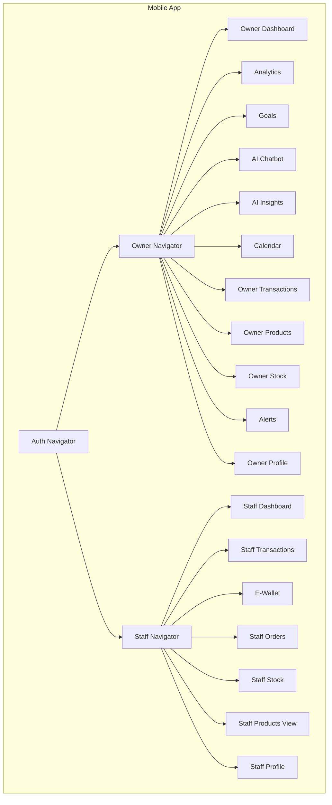
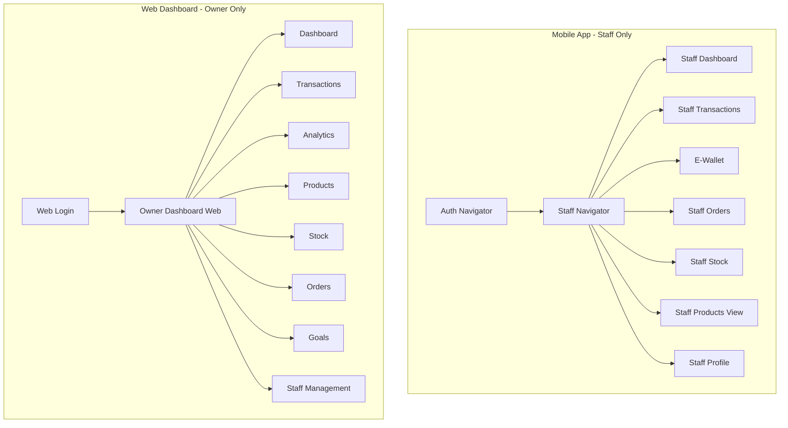

# Design Document

**Feature:** React Native App - Remove Owner Screens (Staff-Only Mobile App)

---

## Overview

This design document outlines the technical approach for converting the GastoTrack React Native app from a dual-role system (Owner + Staff) to a **Staff-only mobile app**. Business Owners will access the system exclusively via the responsive web dashboard.

### Design Goals

1. **Complete Removal**: Delete all owner-specific screens, navigation, and code
2. **Preserve Staff Functionality**: Ensure all staff features continue to work perfectly
3. **Clean Architecture**: Remove unused dependencies, state management, and utilities
4. **Clear User Feedback**: Provide helpful messaging if an owner attempts to log in
5. **Maintainable Codebase**: Leave a simplified, focused codebase for staff features

---

## Architecture Changes

### Current Architecture (Before)



### New Architecture (After)



---

## Component Deletion Strategy

### Phase 1: Screen Deletion

Delete the following files from `src/screens/owner/`:

```
src/screens/owner/
├── AIChatbotScreen.js        ❌ DELETE
├── AIInsightsScreen.js        ❌ DELETE
├── AlertsScreen.js            ❌ DELETE
├── AnalyticsScreen.js         ❌ DELETE
├── CalendarScreen.js          ❌ DELETE
├── DashboardScreen.js         ❌ DELETE
├── GoalsScreen.js             ❌ DELETE
├── NotificationCaptureScreen.js ❌ DELETE
├── ProductsScreen.js          ❌ DELETE
├── ProfileScreen.js           ❌ DELETE
├── StockScreen.js             ❌ DELETE
└── TransactionsScreen.js      ❌ DELETE
```

### Phase 2: Navigation Cleanup

**Delete:**
- `src/navigation/OwnerNavigator.js` - Entire owner navigation stack

**Modify:**
- `src/navigation/RootNavigator.js` - Remove owner role conditional rendering

**Before (RootNavigator.js):**
```javascript
function RootNavigator() {
  const { user, isAuthenticated } = useAuth();

  if (!isAuthenticated) {
    return <AuthNavigator />;
  }

  if (user.role === 'owner') {
    return <OwnerNavigator />;
  } else if (user.role === 'staff') {
    return <StaffNavigator />;
  }
}
```

**After (RootNavigator.js):**
```javascript
function RootNavigator() {
  const { user, isAuthenticated } = useAuth();

  if (!isAuthenticated) {
    return <AuthNavigator />;
  }

  // Mobile app is staff-only
  if (user.role === 'owner') {
    return <OwnerBlockedScreen />;
  }

  return <StaffNavigator />;
}
```

### Phase 3: State Management Cleanup

**Redux Slices to Remove (if exist):**
- `src/store/slices/goalsSlice.js`
- `src/store/slices/analyticsSlice.js`
- `src/store/slices/insightsSlice.js`

**Context Providers to Remove (if exist):**
- `src/contexts/AnalyticsContext.js`
- `src/contexts/GoalsContext.js`

**Update Root Store:**
```javascript
// Before
import goalsReducer from './slices/goalsSlice';
import analyticsReducer from './slices/analyticsSlice';

export const store = configureStore({
  reducer: {
    auth: authReducer,
    transactions: transactionsReducer,
    goals: goalsReducer,           // ❌ REMOVE
    analytics: analyticsReducer,   // ❌ REMOVE
    ...
  },
});

// After
export const store = configureStore({
  reducer: {
    auth: authReducer,
    transactions: transactionsReducer,
    // Only staff-related reducers remain
  },
});
```

### Phase 4: API Service Cleanup

**Functions to Remove from `src/services/api.js` (or similar):**

```javascript
// ❌ DELETE - Owner-only API calls
export const fetchAnalytics = async (period) => { ... };
export const fetchGoals = async () => { ... };
export const createGoal = async (goalData) => { ... };
export const updateGoal = async (id, data) => { ... };
export const deleteGoal = async (id) => { ... };
export const fetchAIInsights = async () => { ... };
export const sendAIChatMessage = async (message) => { ... };

// ✅ KEEP - Shared or staff-specific API calls
export const fetchTransactions = async (filters) => { ... };
export const createTransaction = async (data) => { ... };
export const fetchOrders = async () => { ... };
export const fetchStockItems = async () => { ... };
export const syncOfflineData = async (data) => { ... };
```

### Phase 5: Utility Cleanup

**Utilities to Remove (if owner-specific):**
- `src/utils/chartHelpers.js` - Chart formatting for analytics
- `src/utils/analyticsFormatters.js` - Analytics data formatters
- `src/utils/goalCalculations.js` - Goal progress calculations
- `src/utils/insightGenerators.js` - AI insight helpers

**Utilities to Keep (staff-related):**
- `src/utils/dateHelpers.js`
- `src/utils/currencyFormatters.js`
- `src/utils/validation.js`
- `src/utils/storageHelpers.js`
- `src/utils/syncHelpers.js`

---

## Authentication Flow Changes

### Owner Login Block

Create a new screen to inform owners they should use the web dashboard:

**File:** `src/screens/auth/OwnerBlockedScreen.js`

```javascript
import React from 'react';
import { View, Text, StyleSheet, TouchableOpacity, Linking } from 'react-native';
import { useAuth } from '../contexts/AuthContext';

export default function OwnerBlockedScreen() {
  const { logout } = useAuth();

  const openWebDashboard = () => {
    Linking.openURL('https://gastotrack.com/login');
  };

  return (
    <View style={styles.container}>
      <Text style={styles.icon}>🌐</Text>
      <Text style={styles.title}>Business Owners Use Web Dashboard</Text>
      <Text style={styles.description}>
        The mobile app is designed for staff members. As a business owner, 
        please access GastoTrack from your web browser on mobile, tablet, or computer.
      </Text>
      
      <TouchableOpacity style={styles.webButton} onPress={openWebDashboard}>
        <Text style={styles.webButtonText}>Open Web Dashboard</Text>
      </TouchableOpacity>

      <TouchableOpacity style={styles.logoutButton} onPress={logout}>
        <Text style={styles.logoutText}>Log Out</Text>
      </TouchableOpacity>

      <Text style={styles.footer}>
        Web: https://gastotrack.com
      </Text>
    </View>
  );
}

const styles = StyleSheet.create({
  container: {
    flex: 1,
    justifyContent: 'center',
    alignItems: 'center',
    padding: 20,
    backgroundColor: '#f9fafb',
  },
  icon: {
    fontSize: 64,
    marginBottom: 20,
  },
  title: {
    fontSize: 24,
    fontWeight: 'bold',
    textAlign: 'center',
    marginBottom: 12,
    color: '#1f2937',
  },
  description: {
    fontSize: 16,
    textAlign: 'center',
    color: '#6b7280',
    marginBottom: 32,
    lineHeight: 24,
  },
  webButton: {
    backgroundColor: '#00C897',
    paddingVertical: 14,
    paddingHorizontal: 32,
    borderRadius: 8,
    marginBottom: 16,
  },
  webButtonText: {
    color: 'white',
    fontSize: 16,
    fontWeight: '600',
  },
  logoutButton: {
    paddingVertical: 12,
    paddingHorizontal: 24,
  },
  logoutText: {
    color: '#6b7280',
    fontSize: 14,
  },
  footer: {
    marginTop: 32,
    fontSize: 12,
    color: '#9ca3af',
  },
});
```

### Updated Login Logic

**File:** `src/screens/auth/LoginScreen.js`

```javascript
// In the login handler, check role after successful authentication

const handleLogin = async () => {
  try {
    const response = await login(email, password);
    
    // If owner role, don't proceed to app navigation
    if (response.user.role === 'owner') {
      // RootNavigator will handle showing OwnerBlockedScreen
      // The user state is set but navigation is blocked
      return;
    }
    
    // Staff can proceed normally
    // Navigation handled by RootNavigator
  } catch (error) {
    Alert.alert('Login Failed', error.message);
  }
};
```

### Updated Registration Logic

**Remove Owner Registration Option**

In `src/screens/auth/RegisterScreen.js`, remove the toggle or option to register as owner:

**Before:**
```javascript
<View style={styles.roleSelector}>
  <TouchableOpacity onPress={() => setRole('owner')}>
    <Text>Business Owner</Text>
  </TouchableOpacity>
  <TouchableOpacity onPress={() => setRole('staff')}>
    <Text>Staff Member</Text>
  </TouchableOpacity>
</View>
```

**After:**
```javascript
// No role selector - registration is staff-only
// Owners register via web dashboard
<Text style={styles.infoText}>
  Are you a business owner? Register at https://gastotrack.com
</Text>
```

---

## Dependency Cleanup

### Charts & Data Visualization

If the following libraries are **only** used in owner screens, remove them:

```json
{
  "dependencies": {
    "react-native-chart-kit": "^6.12.0",    // ❌ If owner-only
    "victory-native": "^36.6.8",            // ❌ If owner-only
    "react-native-svg": "^13.9.0"           // ⚠️  Keep if used elsewhere
  }
}
```

**Action:** Search codebase for imports before removing:
```bash
grep -r "react-native-chart-kit" src/screens/staff/
grep -r "victory-native" src/screens/staff/
```

### AI/ML Libraries

If Gemini AI integration is owner-only:

```json
{
  "dependencies": {
    "@google/generative-ai": "^0.1.0"      // ❌ If owner-only
  }
}
```

### Calendar Libraries

If calendar view is owner-only:

```json
{
  "dependencies": {
    "react-native-calendars": "^1.1302.0"  // ❌ If owner-only
  }
}
```

---

## Testing Strategy

### 1. Manual Testing Checklist

**Staff User Flow:**
- [ ] Staff can log in successfully
- [ ] Staff dashboard loads correctly
- [ ] All staff screens are accessible
- [ ] Transactions screen works (create, edit, view)
- [ ] E-wallet screen works (notification capture)
- [ ] Orders screen works (create orders)
- [ ] Stock screen works (view, adjust quantities)
- [ ] Products screen works (view products)
- [ ] Profile screen works (edit profile)
- [ ] Offline sync works correctly

**Owner User Flow:**
- [ ] Owner cannot access app
- [ ] Owner sees clear redirect message
- [ ] "Open Web Dashboard" button works
- [ ] Logout button works
- [ ] Owner cannot register via mobile app

### 2. Automated Testing

**Unit Tests to Update:**
```javascript
// Test owner login is blocked
describe('Authentication', () => {
  it('should block owner login and show redirect screen', async () => {
    const ownerUser = { role: 'owner', email: 'owner@test.com' };
    await login(ownerUser);
    
    // Verify OwnerBlockedScreen is rendered
    expect(screen.getByText(/Business Owners Use Web Dashboard/i)).toBeTruthy();
  });

  it('should allow staff login', async () => {
    const staffUser = { role: 'staff', email: 'staff@test.com' };
    await login(staffUser);
    
    // Verify StaffNavigator is rendered
    expect(screen.getByText(/Staff Dashboard/i)).toBeTruthy();
  });
});
```

### 3. Build Verification

```bash
# Clean install dependencies
rm -rf node_modules
npm install

# Android build
npx react-native run-android

# Check for warnings
# Should see no warnings about missing components or imports
```

---

## Migration Checklist

### Pre-Deletion Audit

- [ ] Search for all imports of owner screens: `grep -r "owner/" src/`
- [ ] List all Redux slices: check `src/store/slices/`
- [ ] List all API services: check `src/services/api.js`
- [ ] List all utilities: check `src/utils/`
- [ ] List all contexts: check `src/contexts/`
- [ ] Review `package.json` dependencies

### Deletion Sequence

1. **Create feature branch**: `git checkout -b feature/mobile-staff-only`
2. **Create OwnerBlockedScreen** (new file)
3. **Update RootNavigator** (modify existing)
4. **Delete OwnerNavigator** (delete file)
5. **Delete all 12 owner screens** (delete directory)
6. **Remove Redux slices** (delete files, update store)
7. **Remove API services** (modify `api.js`)
8. **Remove utilities** (delete unused files)
9. **Update auth screens** (modify login/register)
10. **Remove unused dependencies** (modify `package.json`, run `npm install`)
11. **Test build**: `npx react-native run-android`
12. **Test staff functionality** (manual testing)
13. **Test owner blocking** (manual testing)
14. **Update documentation** (README, comments)
15. **Commit changes**: `git commit -m "refactor: Convert to staff-only mobile app"`

---

## Rollback Plan

If critical issues arise after deployment:

1. **Revert Git commit**: `git revert <commit-hash>`
2. **Rebuild app**: `npx react-native run-android`
3. **Communicate with users**: Inform staff the app is temporarily reverted

**Prevention:** Use feature flags or staged rollout to test with small user group first.

---

## Documentation Updates

### README.md

**Before:**
```markdown
# GastoTrack Mobile App

Expense tracking for Filipino businesses - Owner and Staff editions.
```

**After:**
```markdown
# GastoTrack Mobile App (Staff Edition)

The GastoTrack mobile app is designed for **staff members** to manage daily operations on the go.

**Business Owners:** Please use the web dashboard at https://gastotrack.com

**Features:**
- Create and manage transactions
- E-wallet notification capture (GCash, Maya, etc.)
- Order management with POS
- Stock tracking and inventory
- Offline-first sync
```

### Code Comments

Update any code comments that reference owner features:

**Before:**
```javascript
// Navigate to owner or staff dashboard based on role
```

**After:**
```javascript
// Navigate to staff dashboard (mobile app is staff-only)
```

---

## Future Considerations

### Progressive Web App (PWA)

Consider creating a PWA version of staff screens for:
- Tablet-based POS systems
- Staff members without Android devices
- Faster deployment without app store approval

### Staff Role Tiers

Consider adding staff role differentiation:
- **Staff**: Basic operations
- **Manager**: Advanced features (reports, staff management)
- **Owner**: Web dashboard only

### Business Switching

For staff working at multiple businesses:
- Add business switcher in staff app
- Allow staff to be associated with multiple businesses

---

## Success Metrics

**Code Metrics:**
- LOC reduction: ~2,000-3,000 lines removed
- File reduction: ~12 screens + navigation + state management
- Dependency reduction: 2-5 packages removed
- Bundle size reduction: ~10-15% smaller APK

**Performance Metrics:**
- App launch time: Should remain same or improve
- Memory usage: Should decrease slightly
- Navigation performance: Should remain smooth

**User Experience:**
- Staff users: No negative impact
- Owner users: Clear guidance to web dashboard
- Support tickets: Should decrease (clearer user paths)

---

## Conclusion

This design removes complexity from the React Native app by focusing solely on staff functionality. Business owners gain a superior experience with the responsive web dashboard, while staff get a streamlined mobile app optimized for their daily tasks.

The architecture change simplifies maintenance, reduces build size, and provides a clearer user experience for both user types.
